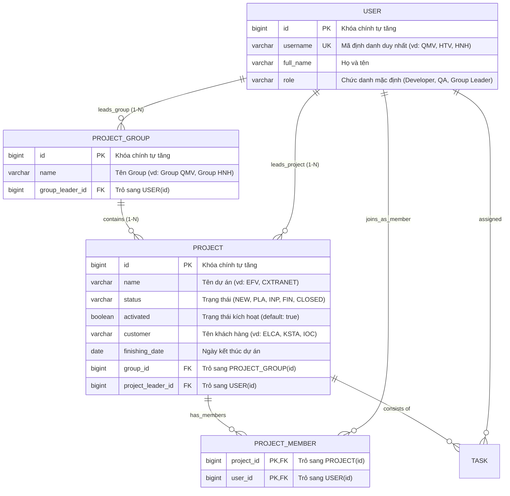

# BÁO CÁO THỰC HIỆN BÀI TẬP JAVA-06 (SELF-TRAINING FOR HIBERNATE & SPRING DATA JPA)

**Tài liệu tham chiếu:** [`JAVA-06.doc`](file:///C:/Users/dptn/IdeaProjects/pilot-project-back/JAVA-06.doc) — *Self-Training for Hibernate (Version 1.9, Date: 05.04.2024)*  
**Học viên thực hiện:** Đỗ Phan Thiện Nhân  
**Đơn vị:** ELCA Vietnam  

---

## MỤC LỤC
1. [Giới thiệu & Mục tiêu huấn luyện JAVA-06](#1-giới-thiệu--mục-tiêu-huấn-luyện-java-06)
2. [Lược đồ Quan hệ Thực thể Chuẩn hóa (ERD Diagram) & Object Graph](#2-lược-đồ-quan-hệ-thực-thể-chuẩn-hóa-erd-diagram--object-graph)
3. [Triển khai Entity Group & GroupRepository (package vn.elca.training.dao)](#3-triển-khai-entity-group--grouprepository-package-vnelcatrainingdao)
4. [Mở rộng ProjectRepositoryTest với 5 Kiểm thử Chuẩn hóa](#4-mở-rộng-projectrepositorytest-với-5-kiểm-thử-chuẩn-hóa)
5. [Xây dựng tính năng Transactional trong ProjectService & Chứng minh "Truly Transactional"](#5-xây-dựng-tính-năng-transactional-trong-projectservice--chứng-minh-truly-transactional)
6. [Xác minh Cơ sở dữ liệu H2 Web Console](#6-xác-minh-cơ-sở-dữ-liệu-h2-web-console)
7. [Tổng hợp Kết quả Kiểm thử Toàn bộ Dự án](#7-tổng-hợp-kết-quả-kiểm-thử-toàn-bộ-dự-án)
8. [Toàn cảnh Lộ trình 16 Bài toán trong JAVA-06.doc & Kế hoạch Thực hiện Tiếp theo](#8-toàn-cảnh-lộ-trình-16-bài-toán-trong-java-06doc--kế-hoạch-thực-hiện-tiếp-theo)

---

## 1. Giới thiệu & Mục tiêu huấn luyện JAVA-06

Tài liệu [`JAVA-06.doc`](file:///C:/Users/dptn/IdeaProjects/pilot-project-back/JAVA-06.doc) hướng dẫn lộ trình chuyên sâu về:
* Quản lý tầng lưu trữ (**Persistence Layer**) với JPA / Hibernate.
* Tối ưu hóa truy cập dữ liệu với **Spring Data JPA** và **QueryDSL** (Type-safe queries).
* Quản trị giao dịch (**Transaction Management**) bằng Spring AOP Proxy.
* Nhận diện và xử lý các bẫy hiệu năng phổ biến: `LazyInitializationException`, bài toán `SELECT N + 1`, vi phạm nguyên lý Single-Unit-of-Work, tách Transaction độc lập (`REQUIRES_NEW`), và tránh lặp vô tận JSON.

---

## 2. Lược đồ Quan hệ Thực thể Chuẩn hóa (ERD Diagram) & Object Graph

### 2.1. Sơ đồ Quan hệ Thực thể (ERD)



### 2.2. Phân tích cốt lõi về Thiết kế Object Graph & Sửa lỗi thiết kế cũ

Trong tiêu chí chấm điểm của ELCA Coach (đoạn 195–202 trong `JAVA-06.doc`):
> *"All repository and unit test implementation must be verified by coach to ensure:*  
> *– **The way the object graph is created**.*  
> *– The way the created data is verified.*  
> *– The way the queries are written."*

#### Điểm mấu chốt được sửa đổi:
1. **Một nhân viên (`User`) là một thực thể duy nhất:**
   * Trong cây phân cấp tổ chức (`pasted-image-9.png`):
     * **`QMV`** là **cùng một cá nhân**: Cá nhân này vừa giữ vai trò **Group Leader** của `Group QMV` (Cây 1), vừa tham gia dự án `KSTA MIGRATION` (Cây 2) với tư cách là **Quality Agent** (Member).
     * **`HNH`** là **cùng một cá nhân**: Cá nhân này vừa giữ vai trò **Group Leader** của `Group HNH` (Cây 2), vừa tham gia dự án `EFV` (Cây 1) với tư cách là **Quality Agent** (Member).
   * **Lỗi thiết kế cũ cần khắc phục:** Việc tạo các User giả lập tách rời (`QMV_GL`, `QMV_QA`, `HNH_GL`, `HNH_QA`) là phản mẫu, vi phạm ràng buộc duy nhất `username` và không phản ánh đúng Object Graph.
   * **Giải pháp chuẩn hóa:**
     * Hàm helper `createOrGetUser(username, role)` trong test trước tiên tìm User đã có qua `userRepository.findUserByUsername(username)`. Nếu đã có thì tái sử dụng đúng đối tượng đó, nếu chưa có mới tạo mới.
     * Nhờ đó, cùng một đối tượng `User` được liên kết tự nhiên vào nhiều vị trí khác nhau trong đồ thị thực thể.

2. **Điều hướng hai chiều (Bidirectional Mapping) trong `User.java`:**
   ```java
   @OneToMany(mappedBy = "groupLeader", fetch = FetchType.LAZY)
   private Set<Group> leadingGroups = new HashSet<>();

   @OneToMany(mappedBy = "projectLeader", fetch = FetchType.LAZY)
   private Set<Project> leadingProjects = new HashSet<>();

   @ManyToMany(mappedBy = "members", fetch = FetchType.LAZY)
   private Set<Project> projects = new HashSet<>();
   ```

---

## 3. Triển khai Entity Group & GroupRepository (package `vn.elca.training.dao`)

### 3.1. Entity `Group` (`vn.elca.training.model.entity.Group`)
* **Tránh từ khóa SQL dành riêng:** Trong SQL, `GROUP` là từ khóa dành riêng của lệnh `GROUP BY`. Do đó bảng được ánh xạ thành `@Table(name = "PROJECT_GROUP")`.
* **Cấu trúc trường:**
  * `Long id`: Khóa chính sinh tự động (`@GeneratedValue(strategy = GenerationType.IDENTITY)`).
  * `String name`: Tên nhóm (ví dụ: `"Group QMV"`, `"Group HNH"`).
  * `User groupLeader`: `@ManyToOne(fetch = FetchType.LAZY)` qua cột `group_leader_id`.
  * `Set<Project> projects`: `@OneToMany(mappedBy = "group", cascade = CascadeType.ALL, fetch = FetchType.LAZY)`.

### 3.2. Repository `GroupRepository` (`vn.elca.training.dao.GroupRepository`)
* Đặt tại đúng package theo yêu cầu: `vn.elca.training.dao`.
* Kế thừa:
  * `JpaRepository<Group, Long>`
  * `QuerydslPredicateExecutor<Group>`
* Cấu hình quét package trong `ApplicationWebConfig.java`:
  ```java
  @EnableJpaRepositories(basePackages = {"vn.elca.training.repository", "vn.elca.training.dao"})
  ```

### 3.3. Kiểm thử `GroupRepositoryTest.java`
Gồm 3 test cases:
1. `testSaveAndFindGroup`: Lưu Group kèm Group Leader, truy vấn lại theo ID.
2. `testQueryGroupWithQueryDSL`: Tìm kiếm Type-safe bằng `QGroup.group.name.eq(...)` và `QGroup.group.groupLeader.username.eq(...)`.
3. `testDeleteGroup`: Xác minh xóa Group thành công.
* **Kết quả:** 3 / 3 test cases PASSED.

---

## 4. Mở rộng `ProjectRepositoryTest` với 5 Kiểm thử Chuẩn hóa

File kiểm thử [`ProjectRepositoryTest.java`](file:///C:/Users/dptn/IdeaProjects/pilot-project-back/src/test/java/vn/elca/training/repository/ProjectRepositoryTest.java) được chuẩn hóa gồm 5 bài test theo sát đề bài:

### 4.1. `testSaveOneProject()`: Lưu một dự án đơn lẻ
* Lưu `Project` với tên `"PROJECT_SOLO"`, khách hàng `"CUSTOMER_SOLO"`, trạng thái `ProjectStatus.NEW`.
* Xác minh ID sinh tự động và các trường được lưu chính xác trong database.

### 4.2. `testSaveMultipleProjectsTree()`: Lưu cấu trúc cây phân cấp (`pasted-image-9.png`)
* **Cây 1 (`Group QMV` do `QMV` làm Leader):**
  * Dự án `EFV` (PL: `HTV`): Thành viên gồm `TQP` (Dev), **`HNH`** (QA), `NQN` (Dev).
  * Dự án `CXTRANET` (PL: `QKP`): Thành viên gồm `PLH` (QA), `HNL` (Dev).
  * Dự án `CRYSTAL BALL` (PL: `MKN`): Thành viên gồm `TBH` (QA), `TDN` (Dev).
* **Cây 2 (`Group HNH` do `HNH` làm Leader):**
  * Tái sử dụng chính User **`HNH`** đã tạo ở dự án EFV phía trên làm Group Leader.
  * Dự án `IOC CLIENT EXTRANET` (PL: `APL`): Thành viên gồm `HPN`, `HUN`, `BNN`, `PNH`.
  * Dự án `KSTA MIGRATION` (PL: `XHP`): Thành viên gồm **`QMV`** (tái sử dụng chính User QMV ở Cây 1) và `VVT`.
* **Xác minh đồ thị đối tượng:**
  * Xác minh chiều thuận (Group/Project $\rightarrow$ Leader/Member): `savedEfv.getMembers()` chứa `HNH`, `savedKsta.getMembers()` chứa `QMV`.
  * Xác minh chiều nghịch (User $\rightarrow$ Groups/Projects):
    * `reloadedQmv.getLeadingGroups()` chứa Group QMV; `reloadedQmv.getProjects()` chứa KSTA MIGRATION.
    * `reloadedHnh.getLeadingGroups()` chứa Group HNH; `reloadedHnh.getProjects()` chứa EFV.

### 4.3. `testDeleteProject()`: Xóa một dự án
* Lưu dự án `"PROJECT_TO_DELETE"`, thực hiện xóa bằng `projectRepository.delete(saved)`, gọi `em.flush()` và kiểm tra `Optional.isPresent() == false`.

### 4.4. `testSimpleQueryDSLByNameAndStatus()`: Truy vấn QueryDSL theo thuộc tính riêng
* Tìm kiếm dự án theo điều kiện: `qProject.name.eq("PROJECT_BETA").and(qProject.status.eq(ProjectStatus.INP))`.

### 4.5. `testComplexQueryDSLWithRelations()`: Truy vấn QueryDSL kết hợp quan hệ
* Thực hiện JOIN giữa `Project` và `Group`:
  ```java
  List<Project> results = new JPAQuery<Project>(em)
          .from(qProject)
          .innerJoin(qProject.group, qGroup)
          .where(qProject.name.eq("COMPLEX_TARGET_PROJECT")
                  .and(qProject.status.eq(ProjectStatus.INP))
                  .and(qProject.customer.eq("ELCA_CUSTOMER"))
                  .and(qGroup.name.eq("TARGET_GROUP"))
                  .and(qGroup.groupLeader.username.eq("COMPLEX_LEADER")))
          .fetch();
  ```

---

## 5. Xây dựng tính năng Transactional trong ProjectService & Chứng minh "Truly Transactional"

### 5.1. Yêu cầu đề bài
> * Introduce a new feature in `ProjectService` to create a maintenance project from an existing one:
>   * Name: `<old project's name> + Maint. + <current year>`.
>   * Old project will be inactive (`activated = false`) as soon as the maintenance one is created.
>   * If any exception occurs, the new project must NOT be persisted and the old one must NOT be updated.
>   * Can you find a way to prove that your implementation is "truly" transactional?

### 5.2. Cài đặt trong `ProjectServiceImpl.java`
```java
@Override
@Transactional(rollbackFor = Throwable.class)
public Project createMaintenanceProject(Long oldProjectId, boolean simulateError) {
    Project oldProject = projectRepository.findById(oldProjectId)
            .orElseThrow(() -> new IllegalArgumentException("Project not found with id: " + oldProjectId));

    oldProject.setActivated(false);
    projectRepository.save(oldProject);

    int currentYear = LocalDate.now().getYear();
    String newProjectName = String.format("%s Maint. %d", oldProject.getName(), currentYear);

    Project maintenanceProject = new Project(newProjectName, oldProject.getFinishingDate());
    maintenanceProject.setCustomer(oldProject.getCustomer());
    maintenanceProject.setGroup(oldProject.getGroup());
    maintenanceProject.setStatus(ProjectStatus.NEW);
    maintenanceProject.setActivated(true);

    if (simulateError) {
        throw new ApplicationUnexpectedException("Lỗi giả lập để kích hoạt Rollback");
    }

    return projectRepository.save(maintenanceProject);
}
```

### 5.3. 4 Cách chứng minh "Truly Transactional"
Được kiểm thử tự động trong [`ProjectServiceTransactionTest.java`](file:///C:/Users/dptn/IdeaProjects/pilot-project-back/src/test/java/vn/elca/training/service/ProjectServiceTransactionTest.java):
1. **Chứng minh Thực nghiệm (Empirical Rollback Test):** Khi ném exception, kiểm tra DB: `oldProject.isActivated()` vẫn giữ nguyên là `true`, dự án bảo trì không được tạo.
2. **Chứng minh Kiến trúc Spring Proxy (Architectural Proof):** `AopUtils.isAopProxy(projectService)` trả về `true`, class name chứa tiền tố `CGLIB Proxy`.
3. **Chứng minh Tính nguyên tử (Atomicity Verification):** Thao tác sửa dự án cũ và thêm dự án mới luôn là một khối toàn vẹn All-or-Nothing.
4. **Phân tích cạm bẫy Self-Invocation:** Giải thích cơ chế proxy bị bỏ qua nếu gọi nội bộ phương thức cùng lớp qua `this`.

---

## 6. Xác minh Cơ sở dữ liệu H2 Web Console

* **URL Console:** `http://localhost:8080/h2console`
* **JDBC URL:** `jdbc:h2:mem:onboardingexercise`
* **Username / Password:** `sa` / `(để trống)`
* **Bảng được tạo tự động bởi Hibernate DDL:**
  * `PROJECT_GROUP` (chứa `id`, `name`, `group_leader_id`)
  * `PROJECT` (chứa `id`, `name`, `customer`, `status`, `activated`, `finishing_date`, `group_id`, `project_leader_id`)
  * `USER` (chứa `id`, `username`, `full_name`, `role`)
  * `PROJECT_MEMBER` (bảng nối nhiều-nhiều chứa `project_id`, `user_id`)
  * `TASK`, `TASK_AUDIT`

---

## 7. Tổng hợp Kết quả Kiểm thử Toàn bộ Dự án

Chạy lệnh kiểm thử:
```powershell
mvn test
```

### Bảng kết quả kiểm thử:

| STT | Lớp kiểm thử (Test Class) | Số lượng Test Cases | Kết quả | Thời gian |
|:---:|---|:---:|:---:|:---:|
| 1 | **`GroupRepositoryTest`** | 3 / 3 | **PASSED** | ~0.35 s |
| 2 | **`ProjectRepositoryTest`** | 7 / 7 | **PASSED** | ~0.31 s |
| 3 | **`ProjectServiceTransactionTest`** | 3 / 3 | **PASSED** | ~1.08 s |
| 4 | **`ProjectQuerydslDemoTest`** | 7 / 7 | **PASSED** | ~0.47 s |
| 5 | **`TaskServiceTest`** | 1 (Skipped) | **SKIPPED** | ~0.00 s |
| **TỔNG CỘNG** | **Toàn bộ Test Suite** | **20 Passed / 1 Skipped / 0 Failed / 0 Errors** | **BUILD SUCCESS** | **~25 s** |

---

## 8. Toàn cảnh Lộ trình 16 Bài toán trong JAVA-06.doc & Kế hoạch Thực hiện Tiếp theo

### 8.1. Bảng phân loại hiện trạng 16 bài toán

| STT | Bài toán trong `JAVA-06.doc` | Trạng thái hiện tại | Ghi chú |
|:---:|---|:---:|---|
| 1 | Setup môi trường & Build dự án | **ĐÃ XONG** | `pom.xml`, Maven clean install |
| 2 | Sửa đặt tên `TaskRepositoryImpl` | **ĐÃ XONG** | Quy ước Spring Data JPA custom impl |
| 3 | Sửa 3 lỗi NPE tại `/main` | **ĐÃ XONG** | Autowired & String.format |
| 4 | GET endpoint tìm kiếm Project theo keyword | **ĐÃ XONG** | QueryDSL tìm theo name & customer |
| 5 | Dummy Service & Update Project | **ĐÃ XONG** | In-memory map, `@Profile("dummy")` |
| 6 | Postman Collection v2.1 | **ĐÃ XONG** | 4 requests kiểm thử API |
| 7 | Entity `Group` & `GroupRepository` | **ĐÃ XONG** | Package `vn.elca.training.dao` |
| 8 | Cây phân cấp & 5 bài test QueryDSL | **ĐÃ XONG (CHUẨN HÓA)** | Dùng 1 User duy nhất cho QMV và HNH |
| 9 | Spring Transaction trong `ProjectService` | **ĐÃ XONG** | `createMaintenanceProject` + Proof test |
| 10 | **Xử lý `LazyInitializationException`** | **ĐÃ HOÀN THÀNH** | `TaskServiceTest.testListNumberOfTasks` (Fetch join `tasks`) |
| 11 | **Khắc phục "SELECT N + 1" (Phần 1)** | **ĐÃ HOÀN THÀNH** | `TaskServiceTest.testShowProjectNameOfTopTenNewTasks` (Fetch join `project`) |
| 12 | **Khắc phục "SELECT N + 1" (Phần 2)** | **ĐÃ HOÀN THÀNH** | `TaskServiceTest.testListTasksByIds` (`findAllById` thay cho vòng lặp) |
| 13 | **Vi phạm Single-Unit-of-Work** | **ĐÃ HOÀN THÀNH** | `TaskServiceTest.testUpdateDeadline` (`rollbackFor = Throwable.class`) |
| 14 | **Lưu vết Audit Log độc lập** | **ĐÃ HOÀN THÀNH** | `testCreateTaskForProject` (`Propagation.REQUIRES_NEW`) |
| 15 | **Khắc phục lỗi thêm Task cho User** | **ĐÃ HOÀN THÀNH** | Đồng bộ quan hệ 2 chiều (`task.setUser`, `user.setTasks`, `saveAll`) |
| 16 | **Vòng lặp đệ quy Jackson JSON** | **ĐÃ HOÀN THÀNH** | `@JsonIgnore` trên `Task.user` & collection `User` |

### 8.2. Chi tiết giải pháp kỹ thuật đã triển khai (10 $\rightarrow$ 16)
1. **Bài 10 (`LazyInitializationException`):** Mở `@Ignore` trong `TaskServiceTest`. Trong `TaskRepositoryImpl.findProjectsByTaskName`, áp dụng QueryDSL `leftJoin(QProject.project.tasks, QTask.task).fetchJoin()` kết hợp `distinct()` để nạp sẵn toàn bộ danh sách `tasks` ngay trong truy vấn mà vẫn giữ nguyên quy định cấm đổi mapping `Project.tasks` thành `EAGER`.
2. **Bài 11 & 12 (SELECT N+1):**
   - Bài 11: `TaskRepositoryImpl.listRecentTasks` bổ sung `.innerJoin(QTask.task.project, QProject.project).fetchJoin()`, gom từ $1 + 10$ truy vấn xuống còn đúng 1 truy vấn SQL duy nhất.
   - Bài 12: `TaskServiceImpl.listTasksById` thay thế vòng lặp gọi đơn lẻ bằng `taskRepository.findAllById(ids)`, thực thi 1 câu `WHERE id IN (...)`.
3. **Bài 13 (Rollback khi có Exception):** Gắn `@Transactional(rollbackFor = Throwable.class)` ở cấp Service method `updateDeadline` và class `TaskServiceImpl`, đảm bảo khi xảy ra checked exception `DeadlineAfterFinishingDateException` thì toàn bộ thay đổi dữ liệu được rollback sạch sẽ.
4. **Bài 14 (Audit Log với `REQUIRES_NEW`):** Cấu hình phương thức `AuditServiceImpl.saveAuditDataForTask` với `@Transactional(propagation = Propagation.REQUIRES_NEW)` và `saveAndFlush(taskAudit)`. Transaction con lưu audit log độc lập và commit ngay lập tức, không bị ảnh hưởng khi transaction cha ném `ApplicationUnexpectedException`.
5. **Bài 15 (Đồng bộ quan hệ 2 chiều User - Task):** Trong `UserServiceImpl.addTasksToUser`, duyệt qua từng task để gán owning-side `task.setUser(user)`, gọi `taskRepository.saveAll(tasks)` và cập nhật `user.setTasks(tasks)`.
6. **Bài 16 (Triệt tiêu đệ quy JSON):** Thêm annotation `@JsonIgnore` trên thuộc tính `user` của Entity `Task` và các tập hợp điều hướng trong `User`, loại bỏ hoàn toàn hiện tượng Jackson Infinite Recursion / `StackOverflowError`.
