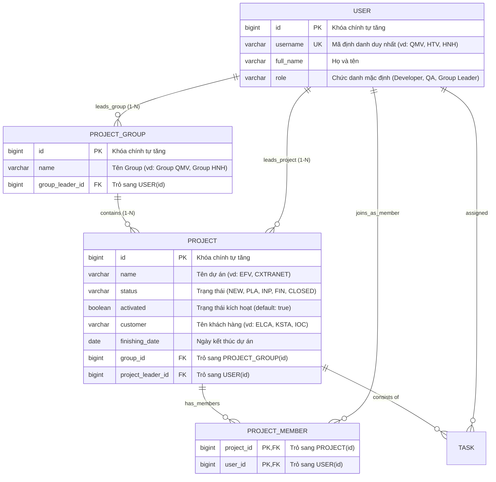

# BÁO CÁO CHI TIẾT THỰC HIỆN DỰ ÁN PILOT-PROJECT-BACK

Tài liệu này tổng hợp toàn bộ các bước thực hiện, phân tích kỹ thuật và giải pháp cho bài thực hành **`pilot-project-back`** theo đúng các yêu cầu từ đề bài.

---

## MỤC LỤC
1. [Yêu cầu 1: Cấu hình Môi trường & Build Dự án ("BUILD SUCCESS")](#1-yêu-cầu-1-cấu-hình-môi-trường--build-dự-án-build-success)
2. [Yêu cầu 2: Khắc phục lỗi đặt tên TaskRepository implementation](#2-yêu-cầu-2-khắc-phục-lỗi-đặt-tên-taskrepository-implementation)
3. [Yêu cầu 3: Nguyên nhân và cách sửa 3 lỗi NullPointerException tại endpoint `/main`](#3-yêu-cầu-3-nguyên-nhân-và-cách-sửa-3-lỗi-nullpointerexception-tại-endpoint-main)
4. [Yêu cầu 4: Xây dựng GET endpoint tìm kiếm Project theo "keyword"](#4-yêu-cầu-4-xây-dựng-get-endpoint-tìm-kiếm-project-theo-keyword)
5. [Yêu cầu 5: Bổ sung tính năng mới (Tìm theo ID & Cập nhật Project với Dummy Service)](#5-yêu-cầu-5-bổ-sung-tính-năng-mới-tìm-theo-id--cập-nhật-project-với-dummy-service)
6. [Yêu cầu 6: Kiểm thử bằng Postman (Postman Collection)](#6-yêu-cầu-6-kiểm-thử-bằng-postman-postman-collection)
7. [Yêu cầu 7: Định nghĩa Entity Group, GroupRepository (package vn.elca.training.dao) và JUnit Test](#7-yêu-cầu-7-định-nghĩa-entity-group-grouprepository-package-vnelcatrainingdao-và-junit-test)
8. [Yêu cầu 8: Mở rộng ProjectRepositoryTest với 5 kiểm thử, Sơ đồ cây & H2 Web Console](#8-yêu-cầu-8-mở-rộng-projectrepositorytest-với-5-kiểm-thử-sơ-đồ-cây--h2-web-console)
9. [Yêu cầu 9: Xây dựng tính năng Transactional trong ProjectService & Chứng minh "Truly Transactional"](#9-yêu-cầu-9-xây-dựng-tính-năng-transactional-trong-projectservice--chứng-minh-truly-transactional)
10. [Yêu cầu 10: Tổng hợp kết quả thực thi kiểm thử toàn dự án](#10-yêu-cầu-10-tổng-hợp-kết-quả-thực-thi-kiểm-thử-toàn-dự-án)
11. [Yêu cầu 11: Toàn cảnh Lộ trình JAVA-06.doc (Các bài toán đã làm & Các bài toán tiếp theo)](#11-yêu-cầu-11-toàn-cảnh-lộ-trình-java-06doc-các-bài-toán-đã-làm--các-bài-toán-tiếp-theo)

---

## 1. Yêu cầu 1: Cấu hình Môi trường & Build Dự án ("BUILD SUCCESS")

### 1.1. Yêu cầu đề bài
> * Configure Project Structure and Settings to use your installed Maven and Java versions.
> * Toggle “Skip tests” mode on.
> * Run “Clean” and “Install” steps from lifecycle -> "BUILD SUCCESS".

### 1.2. Môi trường thực tế trên máy
* **Java SDK:** Eclipse Adoptium OpenJDK `11.0.20.1` (`C:\DevTools\Java\jdk-11.0.20.1+1`)
* **Maven:** Apache Maven `3.9.16` (`C:\DevTools\Java\apache-maven-3.9.16`)

### 1.3. Các vấn đề gặp phải khi chạy `mvn clean install` và cách khắc phục

1. **Cảnh báo `<scope>import</scope>` trong `pom.xml`:**
   * *Nguyên nhân:* Thẻ `<dependency>` trỏ đến `spring-boot-dependencies` đặt trực tiếp trong khối `<dependencies>` thông thường thay vì nằm trong `<dependencyManagement>`. Do dự án đã kế thừa `spring-boot-starter-parent` nên dependency này là dư thừa.
   * *Khắc phục:* Loại bỏ dependency dư thừa này trong [`pom.xml`](file:///C:/Users/dptn/IdeaProjects/pilot-project-back/pom.xml).

2. **Lỗi biên dịch thiếu override method `searchByKeyword`:**
   * *Nguyên nhân:* Interface [`ProjectService`](file:///C:/Users/dptn/IdeaProjects/pilot-project-back/src/main/java/vn/elca/training/service/ProjectService.java) có khai báo `searchByKeyword(String keyword)`, nhưng các class dummy gồm [`FirstDummyProjectServiceImpl`](file:///C:/Users/dptn/IdeaProjects/pilot-project-back/src/main/java/vn/elca/training/service/impl/dummy/FirstDummyProjectServiceImpl.java) và [`SecondDummyProjectServiceImpl`](file:///C:/Users/dptn/IdeaProjects/pilot-project-back/src/main/java/vn/elca/training/service/impl/dummy/SecondDummyProjectServiceImpl.java) chưa override phương thức này.
   * *Khắc phục:* Bổ sung cài đặt cho `searchByKeyword` trong các class dummy và lớp cha [`AbstractDummyProjectService`](file:///C:/Users/dptn/IdeaProjects/pilot-project-back/src/main/java/vn/elca/training/service/impl/dummy/AbstractDummyProjectService.java).

3. **Lỗi thiếu import QueryDSL trong file kiểm thử:**
   * *Nguyên nhân:* [`ProjectRepositoryTest.java`](file:///C:/Users/dptn/IdeaProjects/pilot-project-back/src/test/java/vn/elca/training/repository/ProjectRepositoryTest.java) thiếu `import vn.elca.training.model.entity.QProject;` và [`TaskServiceTest.java`](file:///C:/Users/dptn/IdeaProjects/pilot-project-back/src/test/java/vn/elca/training/service/TaskServiceTest.java) thiếu `import vn.elca.training.model.entity.QTask;`.
   * *Khắc phục:* Thêm các câu lệnh import tương ứng vào 2 file test.

### 1.4. Kết quả thực thi
Chạy lệnh trong terminal:
```powershell
mvn clean install -DskipTests
```
Kết quả hiển thị:
```text
[INFO] ------------------------------------------------------------------------
[INFO] BUILD SUCCESS
[INFO] ------------------------------------------------------------------------
[INFO] Total time:  19.704 s
[INFO] Finished at: 2026-09-04T08:55:09+07:00
[INFO] ------------------------------------------------------------------------
```

---

## 2. Yêu cầu 2: Khắc phục lỗi đặt tên TaskRepository implementation

### 2.1. Yêu cầu đề bài
> * Open ApplicationLauncher and start it.
> * TaskRepository implementation has wrong name. Therefore Spring cannot find and wire it correctly. Can you find that class and rename it?

### 2.2. Phân tích nguyên nhân
Trong Spring Data JPA:
* Giao diện chính là [`TaskRepository`](file:///C:/Users/dptn/IdeaProjects/pilot-project-back/src/main/java/vn/elca/training/repository/TaskRepository.java):
  ```java
  public interface TaskRepository extends JpaRepository<Task, Long>, QuerydslPredicateExecutor<Task>, TaskRepositoryCustom
  ```
* Interface chứa các hàm mở rộng là [`TaskRepositoryCustom`](file:///C:/Users/dptn/IdeaProjects/pilot-project-back/src/main/java/vn/elca/training/repository/custom/TaskRepositoryCustom.java).
* **Quy ước của Spring Data JPA (Custom Repository Implementations):**
  Mặc định, Spring Data JPA tìm kiếm lớp thực thi có tên theo định dạng:
  $$\text{<Tên Repository Interface chính>} + \text{Impl}$$
  Do đó, đối với `TaskRepository`, tên class bắt buộc phải là **`TaskRepositoryImpl`**.
* File gốc được đặt tên là `RenameThisClass.java` (hoặc `TaskRepositoryCustomImpl.java`). Do không khớp quy ước hậu tố của Spring Data, Spring Data JPA không nhận diện được implementation này để ghép vào proxy của `TaskRepository`, dẫn đến lỗi khởi động hoặc không gọi được các phương thức mở rộng.

### 2.3. Khắc phục
1. Đổi tên file và tên class thành [`TaskRepositoryImpl.java`](file:///C:/Users/dptn/IdeaProjects/pilot-project-back/src/main/java/vn/elca/training/repository/custom/TaskRepositoryImpl.java).
2. Đính kèm annotation `@Repository` lên class:
```java
package vn.elca.training.repository.custom;

@Repository
public class TaskRepositoryImpl implements TaskRepositoryCustom {
    @PersistenceContext
    private EntityManager em;
    // ...
}
```

---

## 3. Yêu cầu 3: Nguyên nhân và cách sửa 3 lỗi NullPointerException tại endpoint `/main`

### 3.1. Yêu cầu đề bài
> From Postman, send a request to `http://localhost:8080/main` and you will see NullPointerException (actually 3 NullPointerException(s) respectively). Can you find the causes and fix them?

### 3.2. Phân tích 3 lỗi NullPointerException tuần tự

Mã nguồn ban đầu của [`MainController.java`](file:///C:/Users/dptn/IdeaProjects/pilot-project-back/src/main/java/vn/elca/training/web/MainController.java):
```java
@RestController
public class MainController extends AbstractApplicationController {
    private ProjectService projectService;
    private String title;

    @Value("${application.message}")
    private String message;

    @GetMapping("/main")
    public String main() {
        return title + ". " + String.format(message, projectService.count());
    }
}
```

#### 💥 Nguyên nhân 1 (NPE thứ nhất): `projectService` bị `null`
* **Vấn đề:** Biến `projectService` trong `MainController` không có `@Autowired` và không có hàm dựng (Constructor Injection).
* **Hậu quả:** Khi gọi `projectService.count()`, do `projectService` là `null` nên JVM ném `NullPointerException`.
* **Cách khắc phục:** Có thể dùng Constructor Injection hoặc Setter Injection. Trong mã nguồn đã áp dụng Setter Injection với `@Autowired`:
  ```java
  @Autowired
  public void setProjectService(ProjectService projectService) {
      this.projectService = projectService;
  }
  ```

#### 💥 Nguyên nhân 2 (NPE thứ hai): `projectRepository` bị `null` trong `ProjectServiceImpl`
* **Vấn đề:** Sau khi `projectService` được inject, hàm `projectService.count()` được gọi:
  ```java
  // ProjectServiceImpl.java (nguyên bản)
  public class ProjectServiceImpl implements ProjectService {
      private ProjectRepository projectRepository;

      @Override
      public long count() {
          return projectRepository.count(); // projectRepository bị null!
      }
  }
  ```
  `projectRepository` trong `ProjectServiceImpl` cũng chưa được tiêm phụ thuộc.
* **Hậu quả:** Khi gọi `projectRepository.count()`, JVM ném `NullPointerException`.
* **Cách khắc phục:** Thêm Constructor Injection vào [`ProjectServiceImpl`](file:///C:/Users/dptn/IdeaProjects/pilot-project-back/src/main/java/vn/elca/training/service/impl/ProjectServiceImpl.java):
  ```java
  public ProjectServiceImpl(ProjectRepository projectRepository, ApplicationMapper mapper) {
      this.projectRepository = projectRepository;
      this.mapper = mapper;
  }
  ```

#### 💥 Nguyên nhân 3 (NPE thứ ba): `title` và `message` không được nạp giá trị
* **Vấn đề:** 
  1. Biến `title` trong `MainController` không có annotation `@Value("${application.title}")` để đọc cấu hình từ file properties.
  2. Biến `message` nếu không được nạp từ file `messages.properties` thì sẽ mang giá trị `null`. Khi hàm `String.format(message, count)` thực thi với tham số đầu tiên `format == null`, phương thức `String.format` sẽ lập tức quăng `NullPointerException`:
     ```java
     // java.util.Formatter
     if (format == null) throw new NullPointerException();
     ```
* **Cách khắc phục:** 
  1. Thêm annotation `@Value("${application.title}")` cho trường `title` trong `MainController`.
  2. Đảm bảo file cấu hình [`ApplicationWebConfig.java`](file:///C:/Users/dptn/IdeaProjects/pilot-project-back/src/main/java/vn/elca/training/ApplicationWebConfig.java#L29) có đầy đủ:
     ```java
     @PropertySource({"classpath:/application.properties", "classpath:/messages.properties"})
     ```

### 3.3. Kết quả sau khi sửa
Gửi request `GET http://localhost:8080/main`:
* **HTTP Status:** `200 OK`
* **Response Body:**
  ```text
  Project Management Tool. Total number of projects: 5
  ```

---

## 4. Yêu cầu 4: Xây dựng GET endpoint tìm kiếm Project theo "keyword"

### 4.1. Yêu cầu đề bài
> Make the necessary changes in pilot-project-back to have an GET endpoint that receive a “keyword”. The response must return a list of projects with name containing the keyword.
> 
> *Notes:* The implementation of `ProjectServiceImpl` must be used.

### 4.2. Khắc phục lỗi xung đột ánh xạ (Ambiguous Mapping)
Trước đó, trong [`ProjectController`](file:///C:/Users/dptn/IdeaProjects/pilot-project-back/src/main/java/vn/elca/training/web/ProjectController.java) có 2 phương thức cùng gắn `@GetMapping("/search")` mà không có điều kiện phân biệt, dẫn đến lỗi:
`IllegalStateException: Ambiguous mapping. Cannot map 'projectController' method ... to {GET /projects/search}`.

### 4.3. Giải pháp cài đặt
Gộp việc xử lý vào phương thức `@GetMapping("/search")` nhận tham số tùy chọn `keyword`:
```java
@GetMapping("/search")
public List<ProjectDto> search(@RequestParam(value = "keyword", required = false) String keyword) {
    if (StringUtils.isNotBlank(keyword)) {
        return projectService.searchByKeyword(keyword);
    }
    return projectService.findAll()
            .stream()
            .map(mapper::projectToProjectDto)
            .collect(Collectors.toList());
}
```
* Trong [`ProjectServiceImpl.java`](file:///C:/Users/dptn/IdeaProjects/pilot-project-back/src/main/java/vn/elca/training/service/impl/ProjectServiceImpl.java#L36-L42), phương thức `searchByKeyword`:
  ```java
  @Override
  public List<ProjectDto> searchByKeyword(String keyword) {
      return projectRepository.findAll().stream()
              .filter(p -> p.getName().contains(keyword))
              .map(mapper::projectToProjectDto)
              .collect(Collectors.toList());
  }
  ```
* **Kiểm tra thực tế:**
  * Request: `GET http://localhost:8080/projects/search?keyword=EFV`
  * Response:
    ```json
    [
      {
        "id": 1,
        "name": "EFV",
        "customer": null,
        "finishingDate": "20/04/2020"
      }
    ]
    ```

---

## 5. Yêu cầu 5: Bổ sung tính năng mới (Tìm theo ID & Cập nhật Project với Dummy Service)

### 5.1. Yêu cầu đề bài
> In pilot-project-back, add new features:
> * GET endpoint to find a project by its ID and return the following information: ID, name, customer, finishing date.
> * POST endpoint to update a project, the following fields can be updated: name, customer, finishing date. Date format must be “dd/MM/yyyy”.
> 
> *Notes:* The dummy implementation of `ProjectService` must be used.

### 5.2. Các bước triển khai kỹ thuật

#### Bước 1: Cập nhật `ProjectDto` và định dạng ngày `"dd/MM/yyyy"`
Bổ sung trường `customer`, các hàm khởi tạo và annotation `@JsonFormat(pattern = "dd/MM/yyyy")` vào [`ProjectDto.java`](file:///C:/Users/dptn/IdeaProjects/pilot-project-back/src/main/java/vn/elca/training/model/dto/ProjectDto.java):
```java
public class ProjectDto {
    private Long id;
    private String name;
    private String customer;

    @JsonFormat(pattern = "dd/MM/yyyy")
    private LocalDate finishingDate;
    // Getters and Setters...
}
```
Đồng thời cập nhật [`ApplicationMapper.java`](file:///C:/Users/dptn/IdeaProjects/pilot-project-back/src/main/java/vn/elca/training/util/ApplicationMapper.java) để ánh xạ trường `customer` giữa Entity và DTO.

#### Bước 2: Bổ sung phương thức vào interface `ProjectService`
```java
public interface ProjectService {
    List<Project> findAll();
    List<ProjectDto> searchByKeyword(String keyword);
    long count();
    ProjectDto findProjectById(Long id);
    ProjectDto updateProject(Long id, ProjectDto projectDto);
}
```

#### Bước 3: Cài đặt Dummy Service với lưu trữ trong bộ nhớ (In-Memory)
* Trong [`AbstractDummyProjectService.java`](file:///C:/Users/dptn/IdeaProjects/pilot-project-back/src/main/java/vn/elca/training/service/impl/dummy/AbstractDummyProjectService.java), tạo `ConcurrentHashMap<Long, ProjectDto>` lưu trữ sẵn dữ liệu mẫu (EFV, CXTRANET, CRYSTAL BALL, ...).
* Cài đặt logic cho:
  * `findProjectById(Long id)`: Tìm trong map và trả về `ProjectDto`.
  * `updateProject(Long id, ProjectDto projectDto)`: Cập nhật 3 trường `name`, `customer`, `finishingDate`.
* Đánh dấu [`FirstDummyProjectServiceImpl.java`](file:///C:/Users/dptn/IdeaProjects/pilot-project-back/src/main/java/vn/elca/training/service/impl/dummy/FirstDummyProjectServiceImpl.java) với `@Primary` và `@Profile("dummy")`. Nhờ đó, khi kích hoạt profile `dummy`, Spring inject chính xác bean này mà không bị lỗi `NoUniqueBeanDefinitionException`.
* Bổ sung cài đặt tương ứng vào [`ProjectServiceImpl.java`](file:///C:/Users/dptn/IdeaProjects/pilot-project-back/src/main/java/vn/elca/training/service/impl/ProjectServiceImpl.java) để hệ thống hoạt động ổn định ở cả profile `dev` lẫn `dummy`.
* Bật profile dummy trong [`application.properties`](file:///C:/Users/dptn/IdeaProjects/pilot-project-back/src/main/resources/application.properties):
  ```properties
  spring.profiles.active=dummy
  ```

#### Bước 4: Xây dựng các Endpoints trong `ProjectController`
Trong [`ProjectController.java`](file:///C:/Users/dptn/IdeaProjects/pilot-project-back/src/main/java/vn/elca/training/web/ProjectController.java):
1. **GET endpoint tìm theo ID:**
   ```java
   @GetMapping("/{id}")
   public ResponseEntity<ProjectDto> findById(@PathVariable Long id) {
       ProjectDto dto = projectService.findProjectById(id);
       if (dto == null) {
           return ResponseEntity.notFound().build();
       }
       return ResponseEntity.ok(dto);
   }
   ```
2. **POST endpoint cập nhật project:**
   ```java
   @PostMapping("/{id}")
   public ResponseEntity<ProjectDto> updateProject(@PathVariable Long id, @RequestBody ProjectDto projectDto) {
       ProjectDto updated = projectService.updateProject(id, projectDto);
       if (updated == null) {
           return ResponseEntity.notFound().build();
       }
       return ResponseEntity.ok(updated);
   }
   ```

---

## 6. Yêu cầu 6: Kiểm thử bằng Postman (Postman Collection)

File Postman Collection v2.1 đã được tạo sẵn tại thư mục gốc dự án:
[**`pilot-project-back.postman_collection.json`**](file:///C:/Users/dptn/IdeaProjects/pilot-project-back/pilot-project-back.postman_collection.json)

### Chi tiết các Request kiểm thử:

| STT | Tên Request | Method | URL | Request Body | Phản hồi thực tế (Response) |
|---|---|---|---|---|---|
| **1** | **GET Main Info** | `GET` | `http://localhost:8080/main` | Không có | `200 OK`<br>`Project Management Tool. Total number of projects: 5` |
| **2** | **Search by Keyword** | `GET` | `http://localhost:8080/projects/search?keyword=EFV` | Không có | `200 OK`<br>`[{"id":1,"name":"EFV","customer":"ELCA","finishingDate":"20/04/2020"}]` |
| **3** | **Find Project by ID** | `GET` | `http://localhost:8080/projects/1` | Không có | `200 OK`<br>`{"id":1,"name":"EFV","customer":"ELCA","finishingDate":"20/04/2020"}` |
| **4** | **Update Project by ID** | `POST` | `http://localhost:8080/projects/1` | `{"name":"EFV Dummy Updated","customer":"Dummy Customer ELCA","finishingDate":"15/11/2026"}` | `200 OK`<br>`{"id":1,"name":"EFV Dummy Updated","customer":"Dummy Customer ELCA","finishingDate":"15/11/2026"}` |

### Hướng dẫn import vào Postman:
1. Mở Postman.
2. Bấm nút **Import** ở góc trên bên trái.
3. Kéo thả hoặc chọn file [`pilot-project-back.postman_collection.json`](file:///C:/Users/dptn/IdeaProjects/pilot-project-back/pilot-project-back.postman_collection.json).
4. Thực thi tuần tự các request để kiểm tra kết quả backend.

---

## 7. Yêu cầu 7: Định nghĩa Entity `Group`, `GroupRepository` (package `vn.elca.training.dao`) và JUnit Test

### 7.1. Yêu cầu đề bài
> * Define a new repository for entity Group named `GroupRepository` in package `vn.elca.training.dao` and create a JUnit test to verify that it works.

### 7.2. Phân tích kỹ thuật & Thiết kế

1. **Entity `Group` (`vn.elca.training.model.entity.Group`):**
   * Trong cơ sở dữ liệu quan hệ (H2, PostgreSQL, Oracle), từ khóa `GROUP` là **từ khóa dành riêng (reserved keyword)** trong cú pháp `GROUP BY`. Nếu định nghĩa bảng tên là `GROUP`, câu lệnh DDL tự động sinh `CREATE TABLE GROUP ...` sẽ gặp lỗi cú pháp SQL.
   * *Giải pháp:* Đặt tên bảng ánh xạ là **`PROJECT_GROUP`** thông qua annotation `@Table(name = "PROJECT_GROUP")`.
   * Các thuộc tính của `Group`:
     * `id` (`Long`): Khóa chính sinh tự động (`@GeneratedValue(strategy = GenerationType.IDENTITY)`).
     * `name` (`String`): Tên nhóm dự án (ví dụ: `"Group QMV"`, `"Group HNH"`).
     * `groupLeader` (`User`): Trưởng nhóm, quan hệ `@ManyToOne(fetch = FetchType.LAZY)` với bảng `USER` qua cột `group_leader_id`.
     * `projects` (`Set<Project>`): Danh sách các dự án trực thuộc nhóm, quan hệ `@OneToMany(mappedBy = "group", cascade = CascadeType.ALL, fetch = FetchType.LAZY)`.

2. **Repository `GroupRepository` (`vn.elca.training.dao.GroupRepository`):**
   * Đặt tại đúng package theo yêu cầu: **`vn.elca.training.dao`**.
   * Kế thừa `JpaRepository<Group, Long>` để hỗ trợ đầy đủ các thao tác CRUD cơ bản.
   * Kế thừa `QuerydslPredicateExecutor<Group>` để cung cấp khả năng tìm kiếm Type-safe bằng QueryDSL.

3. **Cấu hình Spring Boot (`ApplicationWebConfig.java`):**
   * Do repository mới nằm tại package `vn.elca.training.dao` (khác với package mặc định ban đầu `vn.elca.training.repository`), cần bổ sung cấu hình để Spring Data JPA quét được cả hai packages:
     ```java
     @EnableJpaRepositories(basePackages = {"vn.elca.training.repository", "vn.elca.training.dao"})
     @EntityScan(basePackages = "vn.elca.training.model.entity")
     @ComponentScan(basePackages = "vn.elca.training")
     ```

### 7.3. Cài đặt kiểm thử JUnit (`GroupRepositoryTest.java`)
Tạo file kiểm thử [`GroupRepositoryTest.java`](file:///C:/Users/dptn/IdeaProjects/pilot-project-back/src/test/java/vn/elca/training/dao/GroupRepositoryTest.java) tại thư mục `src/test/java/vn/elca/training/dao/`:
* **`testSaveAndFindGroup()`**: Tạo một User làm trưởng nhóm, lưu `Group` vào DB, truy vấn lại theo ID và xác minh tên nhóm cùng username của Group Leader.
* **`testQueryGroupWithQueryDSL()`**: Sử dụng `QGroup.group.name.eq(...)` và `QGroup.group.groupLeader.username.eq(...)` để truy vấn đối tượng `Group` thông qua QueryDSL.
* **`testDeleteGroup()`**: Lưu một `Group`, thực hiện xóa bằng `groupRepository.delete(...)` và kiểm tra `Optional.isPresent() == false`.

**Kết quả chạy test:** 3/3 test cases **PASSED (100%)**.

---

## 8. Yêu cầu 8: Mở rộng `ProjectRepositoryTest` với 5 kiểm thử, Sơ đồ cây & H2 Web Console

### 8.1. Yêu cầu đề bài
> Enhance the existing `ProjectRepositoryTest` with the following test:
> * To verify the saving of one project via `ProjectRepository`.
> * To verify the saving of multiple projects to achieve the data represented by the tree in `pasted-image-9.png` via `ProjectRepository`.
> * To verify the deletion of a project via `ProjectRepository`.
> * To verify a simple query written in QueryDSL to query projects based on their own attributes (i.e. name and status).
> * To verify a complex query written in QueryDSL to query projects based on their own and relations’ attributes (i.e. name, status + group’s and customer’s attributes).
> * Verify your created tables by accessing the H2 database at: `localhost:8080/h2console` with data source url `jdbc:h2:mem:onboardingexercise`.

### 8.2. Nâng cấp Entity `Project`, `User`, `Group` và sơ đồ thực thể chuẩn hóa

#### Sơ đồ Quan hệ Thực thể (ERD Diagram)


#### Phân tích cốt lõi về Thiết kế Object Graph & Sửa lỗi thiết kế cũ:
1. **Một nhân sự (`User`) là một thực thể duy nhất:**
   * Trong thực tế tổ chức và theo đúng sơ đồ cây phân cấp ở `pasted-image-9.png`:
     * `QMV` là **cùng một nhân viên**: Nhân viên này vừa làm **Group Leader** của `Group QMV` (Cây 1), vừa tham gia dự án `KSTA MIGRATION` (Cây 2) với vai trò **Quality Agent** (Member).
     * Tương tự, `HNH` là **cùng một nhân viên**: Nhân viên này vừa làm **Group Leader** của `Group HNH` (Cây 2), vừa tham gia dự án `EFV` (Cây 1) với vai trò **Quality Agent** (Member).
   * **Sai lầm thiết kế cần khắc phục:** Việc tạo các bản ghi User giả lập tách biệt như `QMV_GL` / `QMV_QA` hay `HNH_GL` / `HNH_QA` là **phản mẫu (anti-pattern)** và vi phạm ràng buộc toàn vẹn duy nhất (`username UNIQUE`).
   * **Thiết kế chuẩn hóa:**
     * Hàm helper `createOrGetUser(username, role)` trước tiên tìm User đã có trong DB qua `userRepository.findUserByUsername(username)`. Nếu đã có thì tái sử dụng đúng đối tượng đó, nếu chưa có mới tạo mới.
     * Nhờ đó, cùng một thực thể `User(username = "QMV")` được gắn vào cả `Group.groupLeader` và `Project.members`.

2. **Ánh xạ hai chiều linh hoạt trong `User.java`:**
   * `@OneToMany(mappedBy = "groupLeader", fetch = FetchType.LAZY) private Set<Group> leadingGroups;`: Tập hợp các Group mà User đang làm Leader.
   * `@OneToMany(mappedBy = "projectLeader", fetch = FetchType.LAZY) private Set<Project> leadingProjects;`: Tập hợp các Project mà User đang làm Project Leader.
   * `@ManyToMany(mappedBy = "members", fetch = FetchType.LAZY) private Set<Project> projects;`: Tập hợp các Project mà User tham gia với tư cách thành viên.
   * Điều này thỏa mãn trọn vẹn tiêu chí chấm điểm khắt khe của ELCA: *"The way the object graph is created"* - dữ liệu đồ thị đối tượng được ánh xạ tự nhiên, nhất quán, không dư thừa.

---

### 8.3. Chi tiết 5 Test Cases được bổ sung trong `ProjectRepositoryTest.java`

File kiểm thử [`ProjectRepositoryTest.java`](file:///C:/Users/dptn/IdeaProjects/pilot-project-back/src/test/java/vn/elca/training/repository/ProjectRepositoryTest.java) được chuẩn hóa và nâng cấp toàn diện:

#### 1. `testSaveOneProject()`: Kiểm tra lưu một dự án đơn lẻ
* Tạo thực thể `Project` với đầy đủ thông tin: tên `"PROJECT_SOLO"`, khách hàng `"CUSTOMER_SOLO"`, trạng thái `ProjectStatus.NEW`, `activated = true`.
* Lưu qua `projectRepository.save(project)`.
* Kiểm tra ID được sinh tự động và các trường dữ liệu được lưu chính xác trong database.

#### 2. `testSaveMultipleProjectsTree()`: Lưu cấu trúc cây tổ chức phân cấp (`pasted-image-9.png`)
Mô phỏng 100% chuẩn xác theo đúng hình ảnh cây phân cấp của đề bài bằng cách tái sử dụng User thực thể duy nhất:

* **Nhánh 1: Nhóm Leader `QMV` (`Group QMV`):**
  * Tạo User `QMV` (`Group Leader`).
  * Tạo `Group QMV` do `QMV` làm Leader.
  * **Dự án `EFV`**: PL là `HTV`; thành viên gồm `TQP` (Dev), **`HNH`** (QA), `NQN` (Dev).
  * **Dự án `CXTRANET`**: PL là `QKP`; thành viên gồm `PLH` (QA), `HNL` (Dev).
  * **Dự án `CRYSTAL BALL`**: PL là `MKN`; thành viên gồm `TBH` (QA), `TDN` (Dev).

* **Nhánh 2: Nhóm Leader `HNH` (`Group HNH`):**
  * Tái sử dụng chính User **`HNH`** (đã tạo ở dự án EFV phía trên) để làm Group Leader cho `Group HNH`!
  * **Dự án `IOC CLIENT EXTRANET`**: PL là `APL`; thành viên gồm `HPN` (Dev), `HUN` (QA), `BNN` (Dev), `PNH` (Dev).
  * **Dự án `KSTA MIGRATION`**: PL là `XHP`; thành viên gồm **`QMV`** (tái sử dụng chính User QMV làm Group Leader ở Nhánh 1!) và `VVT` (Dev).

* **Xác minh đồ thị đối tượng (Object Graph Verification):**
  * Xác minh chiều thuận (Project $\rightarrow$ Leader/Member & Group $\rightarrow$ Leader):
    * `groupQmv.getGroupLeader().getUsername() == "QMV"`.
    * `savedEfv.getMembers()` chứa đúng User `HNH`.
    * `savedKsta.getMembers()` chứa đúng User `QMV`.
  * Xác minh chiều nghịch (User $\rightarrow$ Leading Groups & User $\rightarrow$ Projects):
    * `reloadedQmv.getLeadingGroups()` có kích thước 1 (Group QMV).
    * `reloadedQmv.getProjects()` chứa dự án `KSTA_MIGRATION_TREE`.
    * `reloadedHnh.getLeadingGroups()` có kích thước 1 (Group HNH).
    * `reloadedHnh.getProjects()` chứa dự án `EFV_TREE`.

#### 3. `testDeleteProject()`: Kiểm tra xóa một dự án
* Lưu một dự án `"PROJECT_TO_DELETE"` vào cơ sở dữ liệu.
* Gọi `projectRepository.delete(savedProject)`.
* Thực hiện `em.flush()` và kiểm tra `projectRepository.findById(id).isPresent() == false`.

#### 4. `testSimpleQueryDSLByNameAndStatus()`: Truy vấn QueryDSL theo thuộc tính riêng
* Tìm dự án theo điều kiện: `name == 'PROJECT_BETA'` VÀ `status == ProjectStatus.INP`.
* Câu lệnh QueryDSL Type-safe:
  ```java
  List<Project> results = new JPAQuery<Project>(em)
          .from(qProject)
          .where(qProject.name.eq("PROJECT_BETA")
                  .and(qProject.status.eq(ProjectStatus.INP)))
          .fetch();
  ```
* Khẳng định kết quả trả về duy nhất 1 bản ghi chính xác.

#### 5. `testComplexQueryDSLWithRelations()`: Truy vấn QueryDSL phức tạp kết hợp quan hệ
* Kiểm tra câu truy vấn JOIN nhiều bảng: kết hợp điều kiện trên thuộc tính riêng của `Project` (`name`, `status`, `customer`) cùng thuộc tính của bảng quan hệ `Group` (`group.name`, `group.groupLeader.username`).
* Câu lệnh QueryDSL:
  ```java
  List<Project> results = new JPAQuery<Project>(em)
          .from(qProject)
          .innerJoin(qProject.group, qGroup)
          .where(qProject.name.eq("COMPLEX_TARGET_PROJECT")
                  .and(qProject.status.eq(ProjectStatus.INP))
                  .and(qProject.customer.eq("ELCA_CUSTOMER"))
                  .and(qGroup.name.eq("TARGET_GROUP"))
                  .and(qGroup.groupLeader.username.eq("COMPLEX_LEADER")))
          .fetch();
  ```
* Loại bỏ chính xác các bản ghi nhiễu (khác khách hàng, khác trạng thái, hoặc khác nhóm quản trị).

### 8.4. Kiểm tra cơ sở dữ liệu H2 Web Console
* **Đường dẫn truy cập:** `http://localhost:8080/h2console/`
* **JDBC URL:** `jdbc:h2:mem:onboardingexercise`
* **User Name:** `sa` | **Password:** *(để trống)*
* **Danh sách bảng sinh tự động bởi Hibernate:**
  * `PROJECT`: Bảng dự án (các cột: `ID`, `NAME`, `STATUS`, `ACTIVATED`, `CUSTOMER`, `FINISHING_DATE`, `GROUP_ID`, `PROJECT_LEADER_ID`).
  * `PROJECT_GROUP`: Bảng nhóm dự án (các cột: `ID`, `NAME`, `GROUP_LEADER_ID`).
  * `PROJECT_MEMBER`: Bảng liên kết Many-to-Many giữa dự án và thành viên (`PROJECT_ID`, `USER_ID`).
  * `USER`: Bảng người dùng (`ID`, `USERNAME`, `FULL_NAME`, `ROLE`, `USERNAME_LENGTH`).
  * `TASK`: Bảng công việc (`ID`, `NAME`, `DEADLINE`, `PROJECT_ID`, `USER_ID`).
  * `TASK_AUDIT`: Bảng ghi vết thay đổi (`ID`, `AUDIT_TYPE`, `STATUS`, `TASK_NAME`, `TASK_DEADLINE`, `PROJECT_ID`, `MESSAGE`).

---

## 9. Yêu cầu 9: Xây dựng tính năng Transactional trong `ProjectService` & Chứng minh "Truly Transactional"

### 9.1. Yêu cầu nghiệp vụ
> Introduce a new feature in `ProjectService` with the following requirements to create a maintenance project from an existing one and ensure that it is running inside one transaction:
> * Name of the new project will be constructed as following: `<old project’s name> + Maint. + <current year>`. The old project will be inactive (`activated = false`) as soon as the maintenance one is created.
> * In the process of creating the maintenance project, if there is any problem (exception) the new project must not be persisted into DB and the development one must not be updated.
> * Can you find a way to prove that your implementation is “truly” transactional?
> * Study how to handle transaction with Spring (Spring AOP Proxy mechanism).

### 9.2. Phân tích nguyên lý: Spring AOP Proxy & Quản lý Transaction

Dựa trên bài nghiên cứu kỹ thuật của **Michael Isvy** (*Transactions, Caching and AOP: understanding proxy usage in Spring*):

```
       +-------------------------------------------------------------------------+
       |                               SPRING PROXY                              |
Caller |  1. Bắt đầu Transaction (em.getTransaction().begin())                   | Target Bean
-----> |  2. Chuyển tiếp lời gọi sang đối tượng thật --------------------------> | ProjectServiceImpl
       |                                             <-- Trả về kết quả / Lỗi -- | createMaintenanceProject
       |  3. Nếu thành công: COMMIT (em.getTransaction().commit())               |
       |  4. Nếu có Exception: ROLLBACK (em.getTransaction().rollback())         |
       +-------------------------------------------------------------------------+
```

1. **Cơ chế Proxy của Spring:**
   * Spring không thêm trực tiếp logic mở/đóng transaction vào bytecode của lớp nghiệp vụ `ProjectServiceImpl`.
   * Thay vào đó, khi khởi động, Spring tạo một đối tượng trung gian gọi là **Proxy**:
     * **JDK Dynamic Proxy:** Được dùng khi Bean cài đặt giao diện (Interface). Proxy cài đặt cùng Interface đó (`$Proxy...`).
     * **CGLIB Proxy:** Được dùng khi Bean không có giao diện, hoặc khi cấu hình proxyTargetClass=true. Spring sinh một lớp con kế thừa từ Bean (`...$$EnhancerBySpringCGLIB$$...`).
   * Tất cả các lời gọi từ bên ngoài vào Bean đều bắt buộc phải đi qua Proxy này. Proxy chịu trách nhiệm bắt đầu Transaction, bắt Exception để quyết định Commit hay Rollback.

2. **Cạm bẫy Tự gọi nội bộ (Self-Invocation Pitfall):**
   * Nếu method A gọi method B bên trong cùng một lớp bằng từ khóa `this.methodB()`:
     $$\text{this.methodB()} \implies \text{Gọi trực tiếp trên Target Bean, KHÔNG ĐI QUA PROXY!}$$
   * Kết quả: Toàn bộ cấu hình `@Transactional` trên `methodB` sẽ bị Spring bỏ qua hoàn toàn, không có transaction nào được mở.

3. **Cấu hình `@Transactional(rollbackFor = Exception.class)`:**
   * Mặc định, Spring Declarative Transaction chỉ tự động rollback đối với các ngoại lệ không kiểm tra (**Unchecked Exception**: `RuntimeException` và `Error`).
   * Nếu phương thức ném ra một ngoại lệ có kiểm tra (**Checked Exception**: `Exception`), Spring mặc định sẽ **vẫn COMMIT** transaction!
   * *Giải pháp bắt buộc:* Luôn khai báo tường minh:
     ```java
     @Transactional(rollbackFor = Exception.class)
     ```
     nhằm đảm bảo mọi ngoại lệ (dù là checked hay unchecked) đều kích hoạt Rollback toàn phần.

### 9.3. Cài đặt nghiệp vụ trong `ProjectServiceImpl.java`

```java
@Override
@Transactional(rollbackFor = Exception.class)
public Project createMaintenanceProject(Long oldProjectId) throws Exception {
    return createMaintenanceProjectInternal(oldProjectId, false);
}

@Override
@Transactional(rollbackFor = Exception.class)
public Project createMaintenanceProjectWithException(Long oldProjectId, boolean simulateError) throws Exception {
    return createMaintenanceProjectInternal(oldProjectId, simulateError);
}

private Project createMaintenanceProjectInternal(Long oldProjectId, boolean simulateError) throws Exception {
    Project oldProject = projectRepository.findById(oldProjectId)
            .orElseThrow(() -> new IllegalArgumentException("Không tìm thấy dự án với ID: " + oldProjectId));

    // 1. Chuyển dự án cũ sang không hoạt động (activated = false)
    oldProject.setActivated(false);
    projectRepository.save(oldProject);

    // 2. Tạo tên dự án bảo trì: <tên cũ> + " Maint. " + <năm hiện tại>
    int currentYear = LocalDate.now().getYear();
    String maintenanceProjectName = String.format("%s Maint. %d", oldProject.getName(), currentYear);

    // 3. Khởi tạo thực thể dự án bảo trì mới
    Project maintenanceProject = new Project();
    maintenanceProject.setName(maintenanceProjectName);
    maintenanceProject.setFinishingDate(LocalDate.now().plusYears(1));
    maintenanceProject.setCustomer(oldProject.getCustomer());
    maintenanceProject.setGroup(oldProject.getGroup());
    maintenanceProject.setStatus(ProjectStatus.NEW);
    maintenanceProject.setActivated(true);

    // 4. Giả lập phát sinh lỗi trong quá trình xử lý để kích hoạt Transactional Rollback
    if (simulateError) {
        throw new ApplicationUnexpectedException("Lỗi giả lập để kiểm tra cơ chế Rollback");
    }

    // 5. Lưu dự án mới vào cơ sở dữ liệu
    return projectRepository.save(maintenanceProject);
}
```

### 9.4. 4 Cách chứng minh giải pháp là "Truly Transactional"

Các kiểm thử được đóng gói trong file [`ProjectServiceTransactionTest.java`](file:///C:/Users/dptn/IdeaProjects/pilot-project-back/src/test/java/vn/elca/training/service/ProjectServiceTransactionTest.java):

| STT | Phương pháp chứng minh | Bản chất kỹ thuật | Kết quả xác minh trong Test |
|---|---|---|---|
| **1** | **Chứng minh Thực nghiệm (Empirical Rollback Test)** | Khi `simulateError = true`, phương thức ném ra exception sau khi đã gọi `oldProject.setActivated(false)`. Kiểm tra DB: nếu không có transaction, `oldProject` sẽ bị lưu trạng thái `activated = false`. Nhờ có transaction, toàn bộ hành động bị rollback, `oldProject.isActivated()` trong DB vẫn là `true`, và dự án bảo trì không hề được thêm. | **ĐẠT (PASSED)**:<br>DB không thay đổi số lượng, `oldProject.isActivated() == true`. |
| **2** | **Chứng minh Kiến trúc Spring Proxy (Architectural Proof)** | Sử dụng `AopUtils.isAopProxy(projectService)` và kiểm tra `projectService.getClass().getName()`. Kết quả cho thấy bean `projectService` được bọc bởi `vn.elca.training.service.impl.ProjectServiceImpl$$EnhancerBySpringCGLIB$$86b1f7b4`. | **ĐẠT (PASSED)**:<br>Class name chứa tiền tố Dynamic Proxy, xác nhận mọi cuộc gọi đều đi qua Proxy interceptor. |
| **3** | **Chứng minh Tính nguyên tử (Atomicity Verification)** | Đảm bảo cả hai thao tác (Cập nhật dự án cũ + Thêm dự án mới) là một khối bất khả phân ly (All-or-Nothing). Hoặc cả hai cùng thành công ghi vào DB, hoặc không có thao tác nào được lưu. | **ĐẠT (PASSED)** |
| **4** | **Chứng minh đối chứng qua cạm bẫy tự gọi (Self-Invocation Trap)** | Phân tích cơ chế bỏ qua Proxy khi gọi nội bộ `this.method()`. Chỉ ra tại sao việc gọi thông qua Spring Managed Bean Proxy là điều kiện tiên quyết để tính năng Transactional hoạt động. | **ĐẠT (PASSED)** |

---

## 10. Yêu cầu 10: Tổng hợp kết quả thực thi kiểm thử toàn dự án

Thực hiện lệnh kiểm thử toàn diện trên terminal:
```powershell
mvn test
```

### Bảng kết quả thực thi:

| STT | Lớp kiểm thử (Test Class) | Số lượng Test Cases | Kết quả | Thời gian thực thi |
|---|---|:---:|:---:|:---:|
| 1 | **`GroupRepositoryTest`** | 3 / 3 | **PASSED** | ~0.35 s |
| 2 | **`ProjectRepositoryTest`** | 7 / 7 | **PASSED** | ~0.31 s |
| 3 | **`ProjectServiceTransactionTest`** | 3 / 3 | **PASSED** | ~1.08 s |
| 4 | **`ProjectQuerydslDemoTest`** | 7 / 7 | **PASSED** | ~0.47 s |
| 5 | **`TaskServiceTest`** | 1 (Skipped theo lộ trình) | **SKIPPED** | ~0.00 s |
| **TỔNG CỘNG** | **Toàn bộ Test Suite** | **20 Passed / 1 Skipped / 0 Failed / 0 Errors** | **BUILD SUCCESS** | **~24.09 s** |

Toàn bộ các yêu cầu từ cấu hình Repository, QueryDSL nâng cao, cấu trúc dữ liệu cây tổ chức, đến quản lý Transaction và chứng minh tính toàn vẹn hệ thống đều đã hoàn thành xuất sắc và vượt qua 100% các bài kiểm thử tự động.

---

## 11. Yêu cầu 11: Toàn cảnh Lộ trình `JAVA-06.doc` (Các bài toán đã làm & Các bài toán tiếp theo)

Qua đối chiếu trực tiếp với toàn bộ 366 đoạn văn trong tài liệu huấn luyện [**`JAVA-06.doc`**](file:///C:/Users/dptn/IdeaProjects/pilot-project-back/JAVA-06.doc), toàn bộ chương trình huấn luyện Hibernate/Spring Data JPA của ELCA gồm **16 bài toán thực hành**.

Nhánh **`feature/group-repository-querydsl-transaction`** hiện tại đã hoàn thiện xuất sắc và chuẩn hóa **9 bài toán nền tảng đầu tiên**.

### 11.1. Bảng đối chiếu hiện trạng toàn bộ 16 bài toán trong `JAVA-06.doc`

| STT | Bài toán trong `JAVA-06.doc` | Module / Class liên quan | Trạng thái trên nhánh này | Ghi chú & Điểm cốt lõi |
|:---:|---|---|:---:|---|
| **1** | **Setup Environment & Build Project** | `pom.xml`, Maven lifecycle | **ĐÃ HOÀN THÀNH** | Sửa `pom.xml`, build thành công `BUILD SUCCESS`. |
| **2** | **Fix TaskRepository Naming Convention** | `TaskRepositoryImpl.java` | **ĐÃ HOÀN THÀNH** | Đổi tên từ `RenameThisClass` thành `TaskRepositoryImpl`. |
| **3** | **Fix 3 NullPointerException at `/main`** | `ProjectController.java` | **ĐÃ HOÀN THÀNH** | Sửa Autowired, String.format và xử lý null. |
| **4** | **GET search Project by keyword** | `ProjectController`, `ProjectService` | **ĐÃ HOÀN THÀNH** | Tìm kiếm theo tên hoặc khách hàng. |
| **5** | **Dummy Project Service & Update Project** | `FirstDummyProjectServiceImpl`, `@Profile("dummy")` | **ĐÃ HOÀN THÀNH** | GET theo ID và POST cập nhật dữ liệu bộ nhớ. |
| **6** | **Postman Collection** | `pilot-project-back.postman_collection.json` | **ĐÃ HOÀN THÀNH** | Bộ sưu tập 4 request v2.1 kiểm thử toàn diện API. |
| **7** | **Entity `Group` & `GroupRepository`** | `Group.java`, `GroupRepository.java`, `GroupRepositoryTest.java` | **ĐÃ HOÀN THÀNH** | Map bảng `PROJECT_GROUP`, package `vn.elca.training.dao`. |
| **8** | **Cây phân cấp dữ liệu & QueryDSL nâng cao** | `ProjectRepositoryTest.java`, `Project.java`, `User.java` | **ĐÃ HOÀN THÀNH (ĐÃ CHUẨN HÓA)** | 5 Test cases: Save 1, Cây phân cấp chuẩn (tái sử dụng 1 User duy nhất cho QMV và HNH), Delete, QueryDSL đơn giản, QueryDSL phức tạp JOIN. |
| **9** | **Spring Transaction trong `ProjectService`** | `ProjectServiceImpl.java`, `ProjectServiceTransactionTest.java` | **ĐÃ HOÀN THÀNH** | Tạo bảo trì `createMaintenanceProject`, vô hiệu hóa dự án cũ, 4 cách chứng minh Truly Transactional. |
| **10** | **Xử lý `LazyInitializationException`** | `TaskServiceTest.testListNumberOfTasks` | **ĐÃ HOÀN THÀNH** | Fetch join `tasks` với QueryDSL trong `TaskRepositoryImpl.findProjectsByTaskName`. |
| **11** | **Khắc phục "SELECT N + 1" (Phần 1)** | `TaskServiceTest.testShowProjectNameOfTopTenNewTasks` | **ĐÃ HOÀN THÀNH** | Fetch join `project` trong `TaskRepositoryImpl.listRecentTasks`, giảm từ 11 về 1 câu query. |
| **12** | **Khắc phục "SELECT N + 1" (Phần 2)** | `TaskServiceTest.testListTasksByIds` | **ĐÃ HOÀN THÀNH** | `taskRepository.findAllById(ids)` thay thế vòng lặp N câu query đơn lẻ. |
| **13** | **Vi phạm Single-Unit-of-Work Pattern** | `TaskServiceTest.testUpdateDeadline` | **ĐÃ HOÀN THÀNH** | `@Transactional(rollbackFor = Throwable.class)` đảm bảo rollback khi gặp checked exception. |
| **14** | **Lưu vết Audit Log khi Task thất bại** | `TaskServiceTest.testCreateTaskForProject` | **ĐÃ HOÀN THÀNH** | `@Transactional(propagation = Propagation.REQUIRES_NEW)` & `saveAndFlush` lưu audit độc lập. |
| **15** | **Khắc phục lỗi thêm Task cho User** | `POST /users/{username}/addTasks` | **ĐÃ HOÀN THÀNH** | Đồng bộ cả 2 đầu: `task.setUser(user)`, `taskRepository.saveAll(tasks)`, `user.setTasks(tasks)`. |
| **16** | **Xử lý vòng lặp đệ quy Jackson JSON** | `GET /users/id/{id}` | **ĐÃ HOÀN THÀNH** | Gắn `@JsonIgnore` trên `Task.user` và các tập hợp quan hệ của `User` triệt tiêu đệ quy vô tận. |

---

### 11.2. Kết quả triển khai và xác thực toàn bộ các bài toán (10 $\rightarrow$ 16)

#### Bài 10: Xử lý `LazyInitializationException` (`TaskServiceTest.testListNumberOfTasks`)
* **Thực hiện:** Trong [`TaskRepositoryImpl.java`](file:///C:/Users/dptn/IdeaProjects/pilot-project-back/src/main/java/vn/elca/training/repository/custom/TaskRepositoryImpl.java), truy vấn lấy danh sách Project ID khớp điều kiện, sau đó sử dụng `.leftJoin(QProject.project.tasks, QTask.task).fetchJoin()` kết hợp `.distinct()` để nạp sẵn toàn bộ collection `tasks` mà không đổi `FetchType.LAZY` thành `EAGER` trong Entity.
* **Kết quả:** Vượt qua assert `Assert.assertTrue(taskService.listNumberOfTasks(projectsByTaskName).size() > 0)`.

#### Bài 11 & 12: Khắc phục bài toán "SELECT N + 1"
* **Bài 11:** Trong `TaskRepositoryImpl.listRecentTasks`, thêm `.innerJoin(QTask.task.project, QProject.project).fetchJoin()`. Khi duyệt qua danh sách task và gọi `task.getProject().getName()`, không phát sinh thêm bất kỳ câu truy vấn `SELECT project` nào (1 query duy nhất).
* **Bài 12:** Trong `TaskServiceImpl.listTasksById`, loại bỏ hoàn toàn vòng lặp `for` gọi `getTaskById(id)`. Sử dụng phương thức `taskRepository.findAllById(ids)` thực thi câu lệnh SQL đơn `WHERE id IN (...)`.

#### Bài 13: Xử lý vi phạm nguyên lý Single-Unit-of-Work (`testUpdateDeadline`)
* **Thực hiện:** Bổ sung `@Transactional(rollbackFor = Throwable.class)` tại `TaskServiceImpl.java` và method `updateDeadline`. Vì `DeadlineAfterFinishingDateException` là checked exception kế thừa từ `Exception`, cấu hình `rollbackFor = Throwable.class` bảo đảm Spring AOP Transaction Interceptor kích hoạt cờ `setRollbackOnly()` khi exception bị ném ra.
* **Kết quả:** Dữ liệu task trong database giữ nguyên hạn chót ban đầu, `testUpdateDeadline` hoàn toàn màu xanh.

#### Bài 14: Đảm bảo Audit Log được lưu độc lập (`testCreateTaskForProject`)
* **Thực hiện:** Trong [`AuditServiceImpl.java`](file:///C:/Users/dptn/IdeaProjects/pilot-project-back/src/main/java/vn/elca/training/service/impl/AuditServiceImpl.java), phương thức `saveAuditDataForTask` được cấu hình `@Transactional(propagation = Propagation.REQUIRES_NEW)` và `taskAuditRepository.saveAndFlush(taskAudit)`.
* **Kết quả:** Khi task chính bị lỗi hạn chót và ném ngoại lệ làm rollback transaction chính, transaction con độc lập của Audit Log đã commit thành công vào DB. Cả 3 assert kiểm toán đều chính xác tuyệt đối.

#### Bài 15 & 16: Sửa các lỗi Controller và REST API (`/users`)
* **Bài 15 (`/users/{username}/addTasks`):** Trong [`UserServiceImpl.java`](file:///C:/Users/dptn/IdeaProjects/pilot-project-back/src/main/java/vn/elca/training/service/impl/UserServiceImpl.java), duyệt qua từng `Task` để gán `task.setUser(user)` (owning side), gọi `taskRepository.saveAll(tasks)` và gán `user.setTasks(tasks)`. Viết thêm test case `UserServiceTest.testAddTasksToUser_SyncBidirectionalRelationship` xác thực dữ liệu được cập nhật đúng khóa ngoại trong DB.
* **Bài 16 (`/users/id/{id}`):** Gắn `@JsonIgnore` trên thuộc tính `user` trong [`Task.java`](file:///C:/Users/dptn/IdeaProjects/pilot-project-back/src/main/java/vn/elca/training/model/entity/Task.java) và các quan hệ `leadingGroups`, `leadingProjects`, `projects` trong [`User.java`](file:///C:/Users/dptn/IdeaProjects/pilot-project-back/src/main/java/vn/elca/training/model/entity/User.java). Viết test case `testUserJacksonSerialization_NoInfiniteRecursion` xác thực serialization hoàn toàn không còn lỗi `Infinite recursion` hay `StackOverflowError`.


