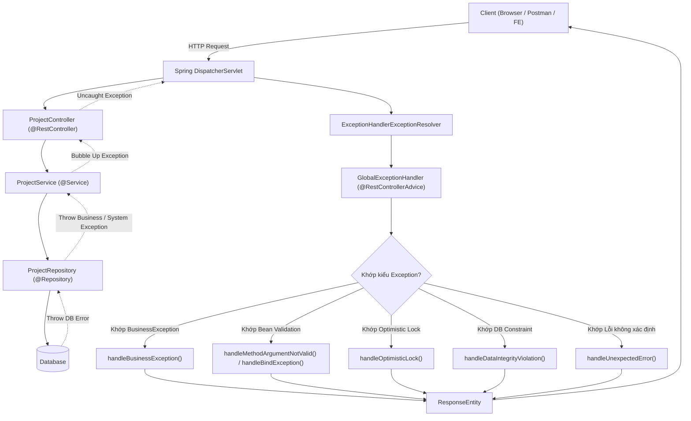

# TÀI LIỆU CHUYÊN SÂU: KIẾN TRÚC GLOBAL EXCEPTION HANDLER TRONG SPRING BOOT

Tài liệu này giải thích chi tiết toàn bộ cú pháp, bản chất hoạt động, cơ chế kế thừa và từng phương thức xử lý lỗi trong file [`GlobalExceptionHandler.java`](file:///C:/Users/dptn/IdeaProjects/pilot-project-back/src/main/java/vn/elca/training/controller/GlobalExceptionHandler.java).

---

## 1. TỔNG QUAN VỀ KIẾN TRÚC XỬ LÝ LỖI TRONG SPRING MVC

### 1.1. Vấn đề của cách xử lý lỗi truyền thống
Nếu không có Global Exception Handler:
- Mỗi Controller hoặc Service phải viết các khối `try-catch` lặp đi lặp lại.
- Khi có lỗi phát sinh không được bắt, Spring Boot sẽ chuyển tiếp sang servlet mặc định `/error` (Whitelabel Error Page), trả về HTML hoặc JSON mặc định để lộ thông tin nhạy cảm (Stack trace, tên bảng DB, phiên bản thư viện...).
- Frontend không thể có một định dạng JSON thống nhất (Consistent Contract) để hiển thị thông báo lỗi thân thiện cho người dùng.

### 1.2. Luồng thực thi khi có ngoại lệ (Exception Workflow)


---

## 2. CÁC ANNOTATION CỐT LÕI VÀ BẢN CHẤT HOẠT ĐỘNG

### 2.1. `@RestControllerAdvice`
- **Cấu tạo**: `@RestControllerAdvice = @ControllerAdvice + @ResponseBody`.
- **Ý nghĩa**: Đánh dấu một Spring Bean đóng vai trò là "Interceptor" (AOP) bao quanh toàn bộ các `@RestController` trong ứng dụng.
- **Cơ chế hoạt động**:
  1. Khi bất kỳ Controller nào quăng (throw) một ngoại lệ mà không bắt lại bằng `try-catch`.
  2. Spring's `DispatcherServlet` sẽ chuyển ngoại lệ đó tới danh sách `HandlerExceptionResolver`.
  3. `ExceptionHandlerExceptionResolver` sẽ quét tất cả các bean có đánh dấu `@ControllerAdvice` / `@RestControllerAdvice` để tìm phương thức phù hợp.
  4. Do có sẵn `@ResponseBody`, giá trị trả về của các hàm xử lý sẽ được chuyển đổi tự động thành JSON qua Jackson `ObjectMapper`.

### 2.2. `@ExceptionHandler(TargetException.class)`
- **Vị trí**: Đặt trên các method bên trong class Advice.
- **Cơ chế so khớp (Exception Hierarchy Matching)**:
  - Spring tìm kiếm phương thức có khai báo class **gần nhất** trong cây phả hệ kế thừa của Exception vừa xảy ra.
  - *Ví dụ*: `ProjectNumberAlreadyExistsException` kế thừa từ `BusinessException`, và `BusinessException` kế thừa từ `RuntimeException`. Nếu có method `@ExceptionHandler(BusinessException.class)` và method `@ExceptionHandler(Exception.class)`, Spring sẽ ưu tiên gọi method xử lý `BusinessException`.

### 2.3. `@ResponseStatus` vs `ResponseEntity<T>`
| Tiêu chí | `@ResponseStatus(HttpStatus.BAD_REQUEST)` | `ResponseEntity<ErrorResponse>` (Khuyên dùng) |
| :--- | :--- | :--- |
| **Tính linh hoạt** | Mã HTTP cố định cứng, không đổi được trong runtime. | Tự do quyết định HTTP Status linh hoạt theo từng logic nghiệp vụ `status.value()`. |
| **HTTP Headers** | Không can thiệp được Header của Response. | Dễ dàng gắn thêm Header (ví dụ `HttpHeaders`, CORS, Location). |
| **Response Body** | Phụ thuộc vào return type cố định. | Bao bọc DTO chuẩn mực, dễ dàng test bằng MockMvc. |

---

## 3. TẠI SAO CẦN KẾ THỪA `ResponseEntityExceptionHandler`?

### 3.1. Bản chất của `ResponseEntityExceptionHandler`
`ResponseEntityExceptionHandler` là một class tiện ích có sẵn trong Spring MVC (`org.springframework.web.servlet.mvc.method.annotation`). 
Nó đã viết sẵn hơn **15 phương thức xử lý** cho toàn bộ các ngoại lệ tiêu chuẩn của giao thức HTTP và Servlet:
- `HttpRequestMethodNotSupportedException` (405 Method Not Allowed)
- `HttpMediaTypeNotSupportedException` (415 Unsupported Media Type)
- `MissingServletRequestParameterException` (400 Bad Request do thiếu query param)
- `ServletRequestBindingException` (400 Bad Request)
- `TypeMismatchException` (400 Bad Request do sai kiểu dữ liệu)
- `HttpMessageNotReadableException` (400 Bad Request do JSON gửi lên sai cú pháp / rách JSON)
- `MethodArgumentNotValidException` (400 Bad Request do lỗi Bean Validation `@Valid` trên body)
- `BindException` (400 Bad Request do lỗi bind tham số từ form hoặc URL params)
- `NoHandlerFoundException` (404 Not Found)

### 3.2. Điểm chốt chặn tập trung: `handleExceptionInternal()`
Thay vì chúng ta phải viết 15 cái `@ExceptionHandler` thủ công cho từng lỗi HTTP kể trên, toàn bộ các hàm có sẵn của `ResponseEntityExceptionHandler` cuối cùng đều gọi về một hàm duy nhất:
```java
protected ResponseEntity<Object> handleExceptionInternal(
        Exception ex, @Nullable Object body, HttpHeaders headers, 
        HttpStatus status, WebRequest request)
```
Do đó, khi ta override hàm này, ta biến toàn bộ các lỗi chuẩn của Spring thành định dạng JSON `ErrorResponse` đồng nhất chỉ với đúng **1 đoạn mã**!

---

## 4. PHÂN BIỆT 3 NGOẠI LỆ VALIDATION DỄ NHẦM LẪN NHẤT

Đây là điểm mấu chốt kỹ thuật khiến nhiều lập trình viên gặp lỗi (và là lý do lúc nãy 4 test cases bị failed):

```
                                  [ DỮ LIỆU GỬI LÊN TỪ CLIENT ]
                                                │
             ┌──────────────────────────────────┴──────────────────────────────────┐
             ▼                                                                     ▼
    [ POST / PUT JSON Body ]                                              [ GET Query Parameters ]
@PostMapping public void create(                                      @GetMapping public void search(
    @Valid @RequestBody ProjectDto dto)                                   @Valid SearchProjectCriteria criteria)
             │                                                                     │
             ▼                                                                     ▼
Lỗi Bean Validation (@NotBlank, @Size...)                             Lỗi ép kiểu String sang Date, Enum...
   ==> Ném ra ngoại lệ:                                                 HOẶC vi phạm @Valid trên Criteria
`MethodArgumentNotValidException`                                            ==> Ném ra ngoại lệ:
                                                                               `BindException`
```

| Tên Ngoại Lệ | Khi Nào Xảy Ra? | Vị trí tham số Controller | Cách xử lý trong Handler |
| :--- | :--- | :--- | :--- |
| **`MethodArgumentNotValidException`** | Dữ liệu JSON trong Body (POST/PUT) vi phạm các annotation Bean Validation (`@NotNull`, `@NotBlank`...). | `@Valid @RequestBody DTO` | Override `handleMethodArgumentNotValid()` |
| **`BindException`** | Tham số trên Query URL (GET) hoặc Form-data không thể bind vào DTO, hoặc DTO đó vi phạm `@Valid`. | `@Valid SearchCriteria` (không có `@RequestBody`) | Override `handleBindException()` |
| **`ConstraintViolationException`** | Validation vi phạm trực tiếp trên tham số đơn lẻ (`@RequestParam`, `@PathVariable`) hoặc trên tầng `@Service` có gắn `@Validated`. | `@RequestParam @Size(max=3) String visa` | Viết `@ExceptionHandler(ConstraintViolationException.class)` |
| **`TypeMismatchException`** | Client truyền chữ vào tham số đòi hỏi số, hoặc truyền text bậy bạ vào trường kiểu Enum. | Mọi tham số URL / Path | Override `handleTypeMismatch()` |

---

## 5. PHÂN TÍCH CHI TIẾT TỪNG PHƯƠNG THỨC TRONG `GlobalExceptionHandler`

Dưới đây là chi tiết mã nguồn hoàn chỉnh và giải nghĩa từng khối code:

### 5.1. Nhóm 1: Xử lý Lỗi nghiệp vụ (`BusinessException`)
```java
@ExceptionHandler(BusinessException.class)
public ResponseEntity<ErrorResponse> handleBusinessException(BusinessException ex, Locale locale) {
    CommonErrorCode code = ex.getErrorCode();
    String message = getLocalizedMessage(code.getMessageKey(), ex.getArgs(), code.name(), locale);
    return buildError(code.getHttpStatus(), code.name(), message, null);
}
```
- **Ý nghĩa**: Bắt tất cả các lỗi nghiệp vụ do lập trình viên chủ động ném (`throw new BusinessException(...)` hoặc các class con như `ProjectNotFoundException`).
- **Điểm độc đáo**:
  - `CommonErrorCode`: Enum chứa sẵn HTTP Status tương ứng (`BAD_REQUEST`, `NOT_FOUND`, `CONFLICT`...).
  - `ex.getArgs()`: Các tham số động truyền vào thông điệp (ví dụ: số thứ tự dự án bị trùng).
  - Tự động dịch thông điệp theo đa ngôn ngữ dựa trên `code.getMessageKey()`.

---

### 5.2. Nhóm 2: Xử lý Lỗi Bean Validation trên tầng Service/Query (`ConstraintViolationException`)
```java
@ExceptionHandler(ConstraintViolationException.class)
public ResponseEntity<ErrorResponse> handleConstraintViolation(ConstraintViolationException ex) {
    Map<String, String> errors = new LinkedHashMap<>();
    for (ConstraintViolation<?> violation : ex.getConstraintViolations()) {
        errors.put(violation.getPropertyPath().toString(), violation.getMessage());
    }
    return buildError(HttpStatus.BAD_REQUEST, CommonErrorCode.VALIDATION_ERROR.name(), "Constraint violation", errors);
}
```
- **Ý nghĩa**: Bắt lỗi khi Bean Validation cấp JSR-380 được kích hoạt độc lập với Spring MVC (thường là tại tầng Service hoặc Hibernate Entity validation).
- **Chi tiết**: Duyệt qua danh sách `violation.getConstraintViolations()` để bóc tách tên trường lỗi (`getPropertyPath()`) và lý do lỗi (`getMessage()`) cho vào Map `errors`.

---

### 5.3. Nhóm 3: Xử lý Lỗi Xung Đột Đồng Thời (`OptimisticLockException`)
```java
@ExceptionHandler({OptimisticLockException.class, ObjectOptimisticLockingFailureException.class})
public ResponseEntity<ErrorResponse> handleOptimisticLock(Exception ex, Locale locale) {
    String message = getLocalizedMessage(CommonErrorCode.OPTIMISTIC_LOCK_ERROR.getMessageKey(), 
            null, "Data has been modified by another user.", locale);
    return buildError(HttpStatus.CONFLICT, CommonErrorCode.OPTIMISTIC_LOCK_ERROR.name(), message, null);
}
```
- **Ý nghĩa**: Khi 2 người dùng cùng sửa 1 Project cùng lúc, trường `@Version` bị so lệch. JPA/Hibernate sẽ ném ra `OptimisticLockException`, Spring bọc lại thành `ObjectOptimisticLockingFailureException`.
- **HTTP Status**: Trả về `409 Conflict`, báo hiệu cho Frontend biết dữ liệu đã bị sửa bởi người khác, cần tải lại trang (Refresh).

---

### 5.4. Nhóm 4: Bắt Lỗi Ràng Buộc Cơ Sở Dữ Liệu (`DataIntegrityViolationException`)
```java
@ExceptionHandler(DataIntegrityViolationException.class)
public ResponseEntity<ErrorResponse> handleDataIntegrityViolation(DataIntegrityViolationException ex, Locale locale) {
    if (ex.getMessage() != null && (ex.getMessage().contains("PROJECT_NUMBER") || ex.getMessage().contains("23505"))) {
        return handleBusinessException(new BusinessException(CommonErrorCode.PROJECT_NUMBER_ALREADY_EXISTS), locale);
    }
    return buildError(HttpStatus.BAD_REQUEST, CommonErrorCode.DATA_INTEGRITY_VIOLATION.name(), "Database constraint violation", null);
}
```
- **Ý nghĩa & Chống TOCTOU (Time-of-Check to Time-of-Use)**:
  - Nếu 2 request cùng tạo Project mang số 1000 cùng 1 tích tắc. Cả 2 đều pass qua câu lệnh kiểm tra `existsByProjectNumber()` ở tầng Java.
  - Khi lưu xuống DB, Database Unique Index sẽ kích hoạt và ném ra lỗi SQL Error Code `23505` (Unique Violation).
  - Handler này bắt lại và chuyển hóa ngay thành lỗi nghiệp vụ `PROJECT_NUMBER_ALREADY_EXISTS` thân thiện, ngăn không cho hệ thống sập thành lỗi 500!

---

### 5.5. Nhóm 5: Override các hàm Validation & Type Mismatch của `ResponseEntityExceptionHandler`
```java
@Override
protected ResponseEntity<Object> handleMethodArgumentNotValid(
        MethodArgumentNotValidException ex, HttpHeaders headers, HttpStatus status, WebRequest request) {
    Map<String, String> errors = new LinkedHashMap<>();
    for (FieldError error : ex.getBindingResult().getFieldErrors()) {
        errors.put(error.getField(), error.getDefaultMessage());
    }
    return createValidationError(errors);
}

@Override
protected ResponseEntity<Object> handleBindException(
        BindException ex, HttpHeaders headers, HttpStatus status, WebRequest request) {
    Map<String, String> errors = new LinkedHashMap<>();
    for (FieldError error : ex.getBindingResult().getFieldErrors()) {
        errors.put(error.getField(), error.getDefaultMessage());
    }
    return createValidationError(errors);
}

@Override
protected ResponseEntity<Object> handleTypeMismatch(
        TypeMismatchException ex, HttpHeaders headers, HttpStatus status, WebRequest request) {
    return createValidationError(null);
}
```
- **Ý nghĩa**: Bắt cả 3 trường hợp: JSON Body sai, Query URL sai format, hoặc truyền bậy Enum/Ngày tháng.
- Tất cả đều được gom chung về hàm `createValidationError()` để trả về chuẩn:
  ```json
  {
    "status": 400,
    "errorCode": "VALIDATION_ERROR",
    "message": "Validation failed",
    "errors": {
      "name": "Project name cannot be empty",
      "status": "Invalid project status"
    },
    "timestamp": "2026-09-24T14:27:00"
  }
  ```

---

### 5.6. Nhóm 6: Chốt chặn an toàn cuối cùng (`Exception.class`)
```java
@ExceptionHandler(Exception.class)
public ResponseEntity<ErrorResponse> handleUnexpectedError(Exception ex, Locale locale) {
    log.error("Unexpected error: ", ex);
    return buildError(HttpStatus.INTERNAL_SERVER_ERROR, CommonErrorCode.INTERNAL_SERVER_ERROR.name(), "Unexpected error occurred.", null);
}
```
- **Ý nghĩa**: Bắt tất cả những gì không nằm trong các nhóm trên (ví dụ `NullPointerException`, lỗi mạng, rớt kết nối DB...).
- **Quy tắc an ninh**:
  - Ghi đầy đủ `log.error(..., ex)` với stack trace vào log file để Dev đọc và điều tra.
  - Nhưng trả về cho Client một câu thông báo chung chung ("Unexpected error occurred"), **tuyệt đối không để lộ mã code hay stack trace cho bên ngoài xem**.

---

## 6. CƠ CHẾ ĐA NGÔN NGỮ (i18n) TRONG EXCEPTION HANDLER

```java
private String getLocalizedMessage(String key, Object[] args, String defaultMessage, Locale locale) {
    try {
        return messageSource.getMessage(
            key, 
            args, 
            defaultMessage, 
            locale != null ? locale : LocaleContextHolder.getLocale()
        );
    } catch (Exception e) {
        return defaultMessage;
    }
}
```

1. **Spring tự động trích xuất Locale**: Khi Controller Method nhận tham số kiểu `Locale locale`, Spring sẽ đọc Header `Accept-Language: fr` (hoặc `en`, `vi`) từ HTTP Request.
2. **`MessageSource`**: Tìm kiếm khóa `key` (ví dụ `project.number.exists`) trong các file:
   - `messages_fr.properties` nếu locale là tiếng Pháp.
   - `messages_en.properties` nếu locale là tiếng Anh.
   - `messages.properties` làm ngôn ngữ mặc định (fallback).
3. **`Object[] args`**: Tự động điền các tham số động vào placeholder `{0}`, `{1}` trong file properties.

---

## 7. BẢNG CHEAT SHEET TRA CỨU NHANH

| Tình Huống Gặp Phải | Lớp Ngoại Lệ (Exception Class) | HTTP Status | Mã Lỗi (errorCode) |
| :--- | :--- | :---: | :--- |
| Tìm không thấy Project theo ID | `BusinessException(PROJECT_NOT_FOUND)` | `404` | `PROJECT_NOT_FOUND` |
| Trùng mã Project khi tạo mới | `BusinessException(PROJECT_NUMBER_ALREADY_EXISTS)` | `400` | `PROJECT_NUMBER_ALREADY_EXISTS` |
| Sửa Project khi đã bị người khác sửa | `OptimisticLockException` | `409` | `OPTIMISTIC_LOCK_ERROR` |
| Thiếu trường bắt buộc trong Form | `MethodArgumentNotValidException` | `400` | `VALIDATION_ERROR` |
| Truyền status bậy trên URL (?status=ABC) | `TypeMismatchException` / `BindException` | `400` | `VALIDATION_ERROR` |
| Sai định dạng JSON (dư dấu phẩy, thiếu ngoặc) | `HttpMessageNotReadableException` | `400` | `BAD_REQUEST` |
| Gọi sai HTTP Method (POST vào URL chỉ nhận GET) | `HttpRequestMethodNotSupportedException` | `405` | `METHOD_NOT_ALLOWED` |
| Đứt cáp DB, NullPointerException | `Exception` | `500` | `INTERNAL_SERVER_ERROR` |
