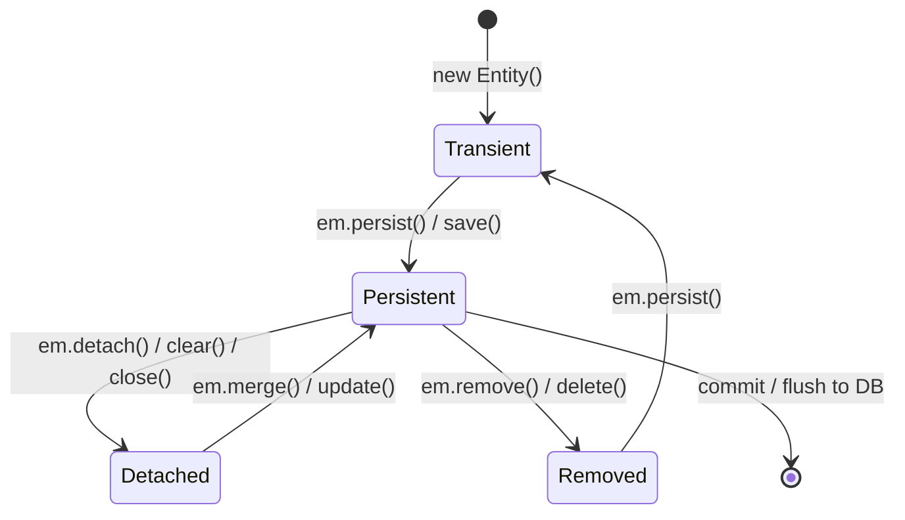
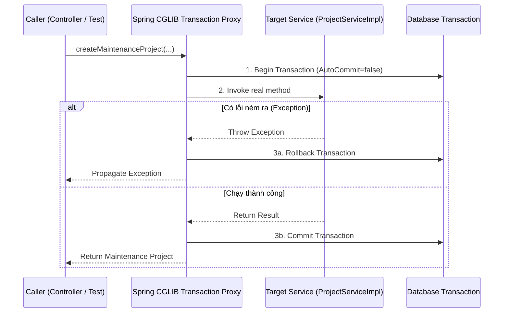

# GIÁO TRÌNH LÝ THUYẾT & LỜI GIẢI CHUYÊN SÂU HIBERNATE / JPA (HIBERNATE-17)

> **Tài liệu tham chiếu gốc:** `HIBERNATE-17.doc` (*Self-training roadmap by GTN, Review by VLP - ELCA Informatik AG*)  
> **Dự án thực hành:** `pilot-project-back` (`onboarding-exercise`)  
> **Phiên bản tài liệu:** 2.0 (Đầy đủ toàn bộ lý thuyết nền tảng, cơ chế hoạt động ngầm Hibernate, Spring Transaction, QueryDSL, và đáp án chi tiết cho từng bài tập).

---

## MỤC LỤC TỔNG QUAN

1. [PHẦN 1: BẢN CHẤT CỦA ORM VÀ OBJECT / RELATIONAL PARADIGM MISMATCH](#phần-1-bản-chất-của-orm-và-object--relational-paradigm-mismatch)
   - 1.1. Sự bất tương đồng mô hình (Paradigm Mismatch)
   - 1.2. 4 cấp độ chất lượng của ORM (Four Levels of ORM Quality)
   - 1.3. Vòng đời thực thể (Entity Lifecycle) trong Hibernate & JPA
   - 1.4. Bộ nhớ đệm cấp 1 (First-Level Cache / Persistence Context) & Cơ chế Dirty Checking
2. [PHẦN 2: LÝ THUYẾT & LỜI GIẢI CHI TIẾT CHO TỪNG YÊU CẦU TRONG HIBERNATE-17](#phần-2-lý-thuyết--lời-giải-chi-tiết-cho-từng-yêu-cầu-trong-hibernate-17)
   - 2.1. Yêu cầu 1: Thiết kế Entity & Ánh xạ quan hệ (Group, Project, User, Task)
   - 2.2. Yêu cầu 2: Spring Data Repositories & Quy ước Custom Repository
   - 2.3. Yêu cầu 3: Xây dựng truy vấn Type-Safe với QueryDSL
   - 2.4. Yêu cầu 4: Quản lý giao dịch Spring (Transaction Management) & Single-Unit-of-Work
   - 2.5. Yêu cầu 5: Ngoại lệ `LazyInitializationException` & Kỹ thuật Fetch Join
   - 2.6. Yêu cầu 6: Khắc phục triệt để bài toán hiệu năng "SELECT N + 1"
   - 2.7. Yêu cầu 7: Đồng bộ quan hệ hai chiều trong bộ nhớ (Bidirectional Synchronization)
   - 2.8. Yêu cầu 8: Xử lý vòng lặp đệ quy Jackson JSON (Infinite Recursion)
3. [PHẦN 3: CÁC CÂU HỎI NÂNG CAO VỀ HIBERNATE SESSION API (ADVANCED ROADMAP)](#phần-3-các-câu-hỏi-nâng-cao-về-hibernate-session-api-advanced-roadmap)
   - 3.1. So sánh chi tiết các Hibernate Session APIs (`get`, `load`, `persist`, `save`, `saveOrUpdate`, `merge`)
   - 3.2. Tính duy nhất danh tính đối tượng trong First-Level Cache
   - 3.3. Mối quan hệ giữa Hibernate Session và Spring Transaction

---

# PHẦN 1: BẢN CHẤT CỦA ORM VÀ OBJECT / RELATIONAL PARADIGM MISMATCH

## 1.1. Sự bất tương đồng mô hình (Object / Relational Paradigm Mismatch)

Khi phát triển phần mềm doanh nghiệp bằng Java (Hướng đối tượng - OOP) kết nối với Cơ sở dữ liệu quan hệ (RDBMS - SQL), lập trình viên phải đối mặt với sự khác biệt cốt lõi giữa hai thế giới:
* **Mô hình Hướng đối tượng (Object-Oriented Model):** Tập trung vào tính đóng gói (Encapsulation), kế thừa (Inheritance), đa hình (Polymorphism), danh tính đối tượng (Identity theo địa chỉ nhớ / `equals`), và điều hướng đồ thị đối tượng (Object Graph Navigation).
* **Mô hình Quan hệ (Relational Model):** Dựa trên lý thuyết tập hợp toán học, dữ liệu tổ chức dưới dạng bảng 2 chiều (Tables) gồm các hàng (Rows) và cột (Columns), quan hệ biểu diễn bằng Khóa chính (Primary Key - PK) và Khóa ngoại (Foreign Key - FK).

Sự bất tương đồng này được chia làm **5 bài toán kinh điển (5 Mismatch Problems)**:

```
+-----------------------------------------------------------------------------------+
|                        OBJECT / RELATIONAL PARADIGM MISMATCH                      |
+--------------------------+--------------------------------------------------------+
| 1. Problem of Granularity| Class phân tách chi tiết (Address, Money) vs SQL Table |
| 2. Problem of Subtypes   | Kế thừa (Inheritance / Polymorphism) vs RDBMS không có |
| 3. Problem of Identity   | Java: == & equals() vs SQL: Primary Key               |
| 4. Problem of Association| Con trỏ tham chiếu 2 chiều vs Khóa ngoại 1 chiều (FK)  |
| 5. Problem of Navigation | Object graph traversal vs SQL JOINs (Gây tắc nghẽn N+1)|
+--------------------------+--------------------------------------------------------+
```

### 1. Vấn đề độ mịn (Problem of Granularity)
* **Trong Java:** Ta dễ dàng tạo ra nhiều lớp nhỏ có độ mịn cao (fine-grained classes) như `Address`, `MoneyAmount`, `ContactInfo` để gom nhóm dữ liệu logic.
* **Trong SQL:** RDBMS thường chỉ có các kiểu dữ liệu cơ bản (`VARCHAR`, `INTEGER`, `DECIMAL`). Việc tạo một kiểu dữ liệu do người dùng tự định nghĩa (User-Defined Type) rất phức tạp và khó tối ưu. Nếu tách bảng thì tốn chi phí `JOIN`, nếu gộp cột thì bảng SQL bị cồng kềnh (coarse-grained).
* **Giải pháp JPA:** Sử dụng `@Embeddable` trên lớp phụ và `@Embedded` / `@AttributeOverride` trong Entity chính để gộp các thuộc tính vào cùng 1 bảng trong DB mà vẫn giữ cấu trúc lớp hướng đối tượng trong mã nguồn Java.

### 2. Vấn đề kế thừa (Problem of Subtypes)
* **Trong Java:** Kế thừa là trụ cột của OOP (`BillingDetails` $\leftarrow$ `CreditCard`, `BankAccount`). Ta có thể viết `billingDetails.pay()`.
* **Trong SQL:** Không có khái niệm "bảng cha" hay "bảng con" (table inheritance). Một bảng không thể kế thừa cấu trúc của một bảng khác.
* **Giải pháp JPA:** Hỗ trợ 3 chiến lược ánh xạ qua `@Inheritance`:
  - `SINGLE_TABLE`: Tất cả lớp cha và con nằm chung 1 bảng, phân biệt bằng cột Discriminator (Nhanh nhất, không cần JOIN, nhưng cột của lớp con phải chấp nhận `NULL`).
  - `JOINED`: Bảng cha chứa thuộc tính chung, mỗi bảng con chứa thuộc tính riêng và có khóa ngoại trỏ về khóa chính bảng cha (Chuẩn hóa tốt, nhưng tốn chi phí `JOIN` khi query).
  - `TABLE_PER_CLASS`: Mỗi lớp con cụ thể là 1 bảng độc lập (Khó thực hiện truy vấn đa hình trên lớp cha).

### 3. Vấn đề danh tính (Problem of Identity)
* **Trong Java:** Có 2 cách so sánh:
  - Đồng nhất tham chiếu bộ nhớ: `a == b` (cùng trỏ tới 1 ô nhớ Heap).
  - Bằng nhau về ngữ nghĩa giá trị: `a.equals(b)` (ghi đè phương thức `equals()` và `hashCode()`).
* **Trong SQL:** Hai bản ghi được coi là duy nhất dựa trên giá trị Khóa chính (**Primary Key**). Hai dòng có thể chứa dữ liệu giống hệt nhau nhưng khác PK thì vẫn là 2 bản ghi độc lập.

### 4. Vấn đề quan hệ liên kết (Problem of Associations)
* **Trong Java:** Quan hệ được định nghĩa thông qua **con trỏ tham chiếu (References)**. Quan hệ có thể là 1 chiều (A trỏ tới B) hoặc 2 chiều (A giữ tham chiếu tới B, B giữ tham chiếu tới A). Quan hệ nhiều-nhiều được biểu diễn bằng các tập hợp `Collection<T>`.
* **Trong SQL:** Quan hệ chỉ được biểu diễn bằng **Khóa ngoại (Foreign Key)**. Khóa ngoại luôn nằm ở bảng con và luôn luôn là quan hệ 1 chiều hướng về khóa chính bảng cha. Để biểu diễn quan hệ nhiều-nhiều, RDBMS **bắt buộc phải sinh ra bảng trung gian (Link/Join Table)** chứa 2 khóa ngoại, trong khi mô hình Domain Model của Java không cần tồn tại thực thể trung gian này.

### 5. Vấn đề truy xuất dữ liệu theo đồ thị (Problem of Data Navigation)
* **Trong Java:** Lập trình viên duyệt đối tượng theo dạng đồ thị: `project.getProjectLeader().getLeadingGroups()`. Việc này duyệt trực tiếp trên con trỏ bộ nhớ RAM.
* **Trong SQL:** Dữ liệu nằm ở ổ cứng/database server. Muốn lấy đủ dữ liệu cho một chuỗi quan hệ, SQL phải thực hiện nhiều câu lệnh `JOIN`. Nếu không JOIN sẵn mà duyệt từng đối tượng, ứng dụng sẽ gửi hàng trăm câu lệnh SQL rời rạc qua mạng $\rightarrow$ Đây chính là nguồn gốc của thảm họa hiệu năng **SELECT N + 1** và lỗi **`LazyInitializationException`**.

---

## 1.2. 4 cấp độ chất lượng của ORM (Four Levels of ORM Quality)

Theo tài liệu chuẩn `JPWH` (Java Persistence with Hibernate):
1. **Pure Relational (Thuần quan hệ):** Ứng dụng (bao gồm cả UI) được thiết kế xoay quanh mô hình quan hệ và các phép toán SQL. Java chỉ đóng vai trò gửi lệnh JDBC thuần (`PreparedStatement`, `ResultSet`).
2. **Light Object Mapping (Ánh xạ thực thể nhẹ):** Các thực thể nghiệp vụ được biểu diễn dưới dạng class Java, nhưng việc ánh xạ sang bảng RDBMS phải viết thủ công bằng code JDBC hoặc SQL Builder. Mã truy cập dữ liệu được che giấu qua DAO Pattern.
3. **Medium Object Mapping (Ánh xạ mức trung bình):** Ứng dụng thiết kế theo mô hình đối tượng (Domain Model). Các câu lệnh SQL và quan hệ đối tượng được sinh tự động bởi cơ chế Persistence tại thời điểm build/runtime. Truy vấn được viết bằng ngôn ngữ hướng đối tượng (HQL/JPQL).
4. **Full Object Mapping (Ánh xạ thực thể toàn diện - Hibernate / JPA):** Hỗ trợ toàn diện mô hình hướng đối tượng tinh vi: kế thừa (Inheritance), đa hình (Polymorphism), cấu trúc thành phần (Composition), quan hệ 2 chiều phức tạp, vòng đời đối tượng tự động (Dirty Checking, Lazy Loading, First-Level Cache, Optimistic Locking).

---

## 1.3. Vòng đời thực thể (Entity Lifecycle) trong Hibernate & JPA

Trong Hibernate, một đối tượng Entity tại một thời điểm bắt buộc phải nằm ở **1 trong 4 trạng thái**:



### 1. Transient (Tạm thời)
* **Đặc điểm:** Đối tượng vừa được khởi tạo bằng từ khóa `new Entity()`.
* **Trạng thái DB:** Chưa từng gắn với bất kỳ bản ghi nào trong Database, chưa có giá trị Khóa chính (`id == null`).
* **Trạng thái Persistence Context:** Hoàn toàn không được quản lý bởi Hibernate Session / EntityManager.
* **JVM Garbage Collection:** Có thể bị bộ thu gom rác (GC) dọn dẹp bất kỳ lúc nào nếu không còn biến tham chiếu tới nó.

### 2. Persistent / Managed (Đang được quản lý)
* **Đặc điểm:** Đối tượng đang nằm trong **Persistence Context** của một Hibernate Session / EntityManager còn mở.
* **Trạng thái DB:** Tương ứng với một dòng thực sự trong bảng (hoặc sẽ được chèn vào DB khi flush/commit). Có Khóa chính đại diện.
* **Đặc tính Dirty Checking:** Mọi thay đổi trên thuộc tính của đối tượng Managed (`entity.setName("New Name")`) **tự động được Hibernate đồng bộ xuống Database** khi commit hoặc flush transaction mà **KHÔNG CẦN gọi hàm `save()` hay `update()`**!

### 3. Detached (Bị tách rời - Nguồn gốc rắc rối)
* **Đặc điểm:** Đối tượng từng ở trạng thái Persistent, đã có Khóa chính (`id`), nhưng hiện tại **không còn nằm trong Persistence Context** (do gọi `em.detach(e)`, `em.clear()`, hoặc Transaction / Session quản lý nó đã đóng lại).
* **Trạng thái DB:** Bản ghi vẫn tồn tại trong Database.
* **Hành vi:** Thay đổi trên đối tượng Detached sẽ **KHÔNG** tự động cập nhật xuống DB. Nếu cố truy cập vào các thuộc tính lazy-loading (`entity.getTasks().size()`), Hibernate sẽ ném ngay lập tức **`LazyInitializationException`** vì không còn Session nào mở để gửi câu lệnh SQL truy vấn.
* **Tái gắn kết (Reattach):** Dùng `em.merge(entity)` để copy dữ liệu từ đối tượng detached vào một đối tượng persistent mới.

### 4. Removed (Đã đánh dấu xóa)
* **Đặc điểm:** Đối tượng từng ở trạng thái Persistent nhưng đã được đánh dấu để xóa khỏi Database thông qua `em.remove(entity)` hoặc `session.delete(entity)`.
* **Hành vi:** Đối tượng vẫn tồn tại trong bộ nhớ RAM Java cho tới khi Transaction kết thúc, nhưng câu lệnh SQL `DELETE FROM table WHERE id = ?` sẽ được thực thi khi flush. Sau khi commit, đối tượng quay về trạng thái Transient.

---

## 1.4. Bộ nhớ đệm cấp 1 (First-Level Cache) & Cơ chế Dirty Checking

### 1. First-Level Cache (L1 Cache) là gì?
* L1 Cache là bộ nhớ đệm gắn liền với **một Session / EntityManager cụ thể**. Nó luôn luôn được bật mặc định và **không thể tắt**.
* Phạm vi (Scope): Chỉ tồn tại trong suốt vòng đời của Session / Transaction hiện tại. Khi Session đóng lại (`session.close()`), L1 Cache bị giải phóng hoàn toàn.
* **Lợi ích 1 - Tránh truy vấn lặp (Query Elimination):** Khi gọi `findById(1L)` lần thứ nhất, Hibernate truy vấn DB và lưu thực thể vào L1 Cache. Khi gọi lại `findById(1L)` lần thứ hai trong cùng Session, Hibernate trả về ngay thực thể từ L1 Cache mà **không gửi thêm bất kỳ câu SQL nào xuống DB**.
* **Lợi ích 2 - Đảm bảo tính duy nhất danh tính (Repeatable Read in Memory):** Trong cùng 1 Session, hai lần gọi `em.find(User.class, 1L)` luôn trả về **chính xác cùng một tham chiếu ô nhớ** (`user1 == user2` trả về `true`).

### 2. Cơ chế Dirty Checking (Tự động phát hiện thay đổi) hoạt động ngầm như thế nào?
1. Khi một Entity được tải vào Persistence Context (từ DB lên hoặc qua `persist`), Hibernate tạo ra một bản sao lưu trạng thái ban đầu của đối tượng gọi là **Snapshot** lưu trong L1 Cache.
2. Trong quá trình chạy nghiệp vụ, lập trình viên gọi các setter: `project.setName("Updated Project")`.
3. Khi Transaction chuẩn bị Commit (hoặc khi gọi `em.flush()`):
   - Hibernate duyệt qua toàn bộ các Entity đang ở trạng thái Managed.
   - So sánh trạng thái hiện tại của từng Entity với bản sao Snapshot ban đầu.
   - Nếu phát hiện thuộc tính có sự khác biệt (bị "dirty"), Hibernate tự động sinh câu lệnh SQL `UPDATE ... SET ... WHERE id = ?` và đưa vào hàng đợi JDBC Batching để thực thi xuống Database.

---

# PHẦN 2: LÝ THUYẾT & LỜI GIẢI CHI TIẾT CHO TỪNG YÊU CẦU TRONG HIBERNATE-17

## 2.1. Yêu cầu 1: Thiết kế Entity & Ánh xạ quan hệ (Group, Project, User, Task)

### Lý thuyết nền tảng từ HIBERNATE-17:
* `@Entity` (thuộc `javax.persistence.Entity`): Bắt buộc để báo cho JPA biết đây là một Persistent Entity. Nếu thiếu, Hibernate ném lỗi `MappingException: Unknown entity`.
* `@Table(name = "...")`: Chỉ định tên bảng trong cơ sở dữ liệu.
  > [!IMPORTANT]
  > Trong bài tập, Entity `Group` **bắt buộc** phải khai báo `@Table(name = "PROJECT_GROUP")`. Trong chuẩn SQL và cơ sở dữ liệu H2/PostgreSQL/MySQL, `GROUP` là từ khóa dành riêng (reserved keyword của mệnh đề `GROUP BY`). Nếu không đặt tên bảng là `PROJECT_GROUP`, câu lệnh DDL `CREATE TABLE GROUP ...` sẽ gãy với lỗi cú pháp SQL `Syntax error in SQL statement`.
* `@Version`: Bổ sung khả năng **Khóa lạc quan (Optimistic Locking)**. Khi hai transaction cùng đọc 1 bản ghi và cùng sửa, Hibernate so sánh trường `@Version`. Bên nào commit sau mà version trong DB đã bị bên trước tăng lên thì Hibernate sẽ ném ngay ngoại lệ `OptimisticLockException` (hoặc `StaleObjectStateException`), bảo vệ dữ liệu không bị ghi đè mất dấu (Lost Update).

### Bản chất của 4 chiến lược sinh khóa chính (`@GeneratedValue`):
1. `GenerationType.IDENTITY`: Sử dụng cột tự tăng (`AUTO_INCREMENT` trong MySQL/H2, `IDENTITY` trong SQL Server).
   - **Nhược điểm hiệu năng:** Database chỉ cấp phát ID khi câu lệnh `INSERT` thực sự chạy xuống DB. Do đó, Hibernate bắt buộc phải thực thi ngay câu lệnh `INSERT` để lấy ID về gán cho Entity, làm **vô hiệu hóa hoàn toàn cơ chế JDBC Batch Insert**!
2. `GenerationType.SEQUENCE`: Sử dụng đối tượng `SEQUENCE` của DB (Oracle, PostgreSQL, H2). Hibernate có thể lấy trước một dải ID (sequence allocationSize) từ DB mà chưa cần INSERT $\rightarrow$ Tối ưu hóa tuyệt vời cho JDBC Batching.
3. `GenerationType.TABLE`: Dùng 1 bảng riêng để lưu giá trị ID tiếp theo $\rightarrow$ Chậm nhất, sinh khóa lock bảng, không khuyến nghị dùng trong thực tế.
4. `GenerationType.AUTO`: Để Persistence Provider tự động chọn tùy theo loại Database.

### Bản chất thuộc tính `mappedBy`:
* Trong quan hệ 2 chiều (Bidirectional Association), bắt buộc phải có một bên làm **Owning Side** (Bên sở hữu quan hệ - nắm giữ cột Khóa ngoại trong Database) và một bên làm **Inverse / Reverse Side** (Bên phản chiếu).
* `mappedBy` **LUÔN LUÔN** nằm ở phía **Inverse Side** và trỏ đến tên thuộc tính của phía Owning Side. Phía có `mappedBy` **KHÔNG BAO GIỜ** được khai báo `@JoinColumn`.
* **Hậu quả nếu thiếu `mappedBy` ở `@OneToMany`:** Hibernate sẽ hiểu lầm đây là 2 quan hệ 1 chiều độc lập. Khi đó Hibernate sẽ tự động sinh ra một bảng trung gian không mong muốn (`JoinTable` như `project_tasks`) gây lãng phí bộ nhớ lưu trữ và phát sinh thêm các câu lệnh SQL UPDATE không cần thiết!

---

## 2.2. Yêu cầu 2: Spring Data Repositories & Quy ước Custom Repository

### 1. Cây phân cấp Interface của Spring Data JPA
```
+-------------------------------------------------------------+
|                 Repository<T, ID>                           |  (Marker Interface rỗng)
+------------------------------+------------------------------+
                               |
+------------------------------v------------------------------+
|               CrudRepository<T, ID>                         |  (Cung cấp: save, findById,
+------------------------------+------------------------------+   existsById, count, delete)
                               |
+------------------------------v------------------------------+
|        PagingAndSortingRepository<T, ID>                    |  (Bổ sung: findAll(Sort),
+------------------------------+------------------------------+   findAll(Pageable))
                               |
+------------------------------v------------------------------+
|               JpaRepository<T, ID>                          |  (Bổ sung: flush, saveAndFlush,
+-------------------------------------------------------------+   deleteInBatch, getOne,...)
```

### 2. Quy ước đặt tên Custom Repository trong Spring Data JPA
Khi các method tự sinh (Derived Query Methods) hoặc `@Query` không đủ để xử lý logic phức tạp (như truy vấn động QueryDSL, gọi Stored Procedure, tối ưu hóa câu lệnh):
1. Định nghĩa Interface mở rộng: `TaskRepositoryCustom`.
2. Tạo lớp cài đặt tuân theo **quy tắc hậu tố (Postfix Convention)** của Spring Data:
   - Tên lớp phải là: `<Tên_Repository_Chính>Impl` $\rightarrow$ [`TaskRepositoryImpl.java`](file:///C:/Users/dptn/IdeaProjects/pilot-project-back/src/main/java/vn/elca/training/repository/custom/TaskRepositoryImpl.java).
   - Nếu đặt tên sai (như mã nguồn gốc đặt là `RenameThisClass`), Spring Data JPA sẽ không thể quét và liên kết lớp cài đặt vào Bean Proxy của Repository, dẫn đến lỗi khởi động ApplicationContext hoặc `AbstractMethodError` lúc runtime!
3. Interface Repository chính kế thừa cả hai:
   ```java
   public interface TaskRepository extends JpaRepository<Task, Long>, TaskRepositoryCustom {
   }
   ```

---

## 2.3. Yêu cầu 3: Xây dựng truy vấn Type-Safe với QueryDSL

### 1. Tại sao dự án thực tế bắt buộc phải dùng Dynamic Query (QueryDSL)?
* **Điểm yếu của Spring Data Derived Query (`findBy...`):** Chỉ chạy với số tham số cố định. Nếu màn hình có 5 tiêu chí tìm kiếm tùy chọn (keyword, customer, dateFrom, dateTo, status), ta sẽ phải viết $2^5 = 32$ phương thức khác nhau.
* **Điểm yếu của JPQL ghép chuỗi (`"WHERE 1=1 " + ...`):** Dễ lỗi cú pháp, dễ bị SQL Injection, và không kiểm tra được lỗi chính tả lúc compile.
* **QueryDSL giải quyết triệt để:**
  - Sinh ra các **Q-Classes** (`QProject`, `QGroup`, `QUser`, `QTask`) ánh xạ trực tiếp từ Entity.
  - Kiểm tra an toàn kiểu dữ liệu lúc biên dịch (**Compile-Time Safety**): Nếu Entity đổi tên trường `customer` thành `client`, code QueryDSL sẽ báo lỗi đỏ ngay lập tức trong IDE, không thể build nếu chưa sửa.
  - Cho phép dùng `BooleanBuilder` để ghép các điều kiện lọc động mà mã nguồn vẫn cực kỳ trong sáng và hướng đối tượng.

---

## 2.4. Yêu cầu 4: Quản lý giao dịch Spring (Transaction Management) & Single-Unit-of-Work

### 1. Bản chất Transaction & Nguyên lý Single-Unit-of-Work
* **Transaction (Giao dịch):** Là một tập hợp các thao tác ghi/đọc cơ sở dữ liệu được gom lại thành một khối logic duy nhất tuân thủ nguyên lý **ACID**:
  - **A (Atomicity - Nguyên tử):** "Tất cả hoặc không gì cả" (All-or-Nothing). Hoặc toàn bộ thao tác thành công và được lưu vĩnh viễn vào DB, hoặc nếu có một thao tác thất bại thì toàn bộ những gì đã làm trước đó phải được hoàn tác (**Rollback**) về trạng thái ban đầu.
  - **C (Consistency - Nhất quán):** Dữ liệu luôn chuyển từ trạng thái hợp lệ này sang trạng thái hợp lệ khác, tuân thủ mọi ràng buộc dữ liệu.
  - **I (Isolation - Cô lập):** Các transaction chạy đồng thời không được nhìn thấy dữ liệu trung gian chưa commit của nhau.
  - **D (Durability - Bền vững):** Một khi đã commit, dữ liệu tồn tại vĩnh viễn kể cả khi hệ thống bị sập nguồn.
* **Single-Unit-of-Work:** Đảm bảo toàn bộ nghiệp vụ trong một use case (ví dụ: tạo Maintenance Project và vô hiệu hóa Project cũ) phải cùng nằm trong một Transaction duy nhất. Nếu bước 2 lỗi, bước 1 bắt buộc phải được rollback.

### 2. Cơ chế Spring AOP Proxy cho `@Transactional`
Khi một bean được đánh dấu `@Transactional`, Spring không gọi trực tiếp class thực mà sinh ra một **Proxy Class** (qua CGLIB Proxy) bọc bên ngoài:



> [!WARNING]
> **Bẫy tự gọi (Self-Invocation Pitfall):** Nếu trong cùng một class `ProjectServiceImpl`, method A gọi `this.methodB()` (trong đó method B có `@Transactional(propagation = Propagation.REQUIRES_NEW)`), thì Transaction của method B **hoàn toàn KHÔNG có tác dụng**! Lý do: Lời gọi `this` là gọi trực tiếp trong nội bộ đối tượng Java, hoàn toàn bỏ qua lớp vỏ bọc Spring AOP Proxy!

### 3. Bẫy Rollback mặc định của Spring (Unchecked vs Checked Exception)
* **Mặc định của Spring:**
  - Chỉ tự động rollback khi gặp **Unchecked Exceptions** (các class kế thừa từ `java.lang.RuntimeException` hoặc `java.lang.Error`).
  - Khi gặp **Checked Exceptions** (kế thừa trực tiếp từ `java.lang.Exception`), Spring mặc định **VẪN COMMIT TRANSACTION**!
* **Khắc phục:** Luôn luôn khai báo tường minh `@Transactional(rollbackFor = Throwable.class)` ở cấp Service để đảm bảo an toàn tuyệt đối trước mọi loại ngoại lệ.

### 4. Bảng phân tích 7 mức độ lan truyền giao dịch (Transaction Propagation)

| Propagation | Hành vi cụ thể | Ứng dụng thực tế |
|---|---|---|
| **`REQUIRED`** *(Default)* | Nếu đã có Transaction cha đang chạy $\rightarrow$ tham gia vào. Nếu chưa có $\rightarrow$ tạo mới. | Phù hợp cho 90% các tác vụ nghiệp vụ thông thường. |
| **`REQUIRES_NEW`** | **Luôn luôn tạo một Transaction độc lập mới**. Nếu đang có Transaction cha $\rightarrow$ tạm dừng (suspend) transaction cha, chạy và commit transaction con xong mới tiếp tục cha. | **Dùng cho Audit Log, gửi email, trừ tiền ví điện tử độc lập** (không bị rollback theo cha). |
| **`SUPPORTS`** | Nếu có transaction thì chạy trong transaction, nếu không có thì chạy phi transaction. | Dùng cho các hàm đọc dữ liệu (Read-only queries). |
| **`MANDATORY`** | Bắt buộc phải được gọi bên trong một Transaction sẵn có. Nếu không có $\rightarrow$ ném ngoại lệ `IllegalTransactionStateException`. | Dùng khi thao tác dữ liệu bắt buộc phải là một phần của quy trình lớn hơn. |
| **`NOT_SUPPORTED`** | Luôn chạy phi transaction. Nếu có transaction đang mở $\rightarrow$ tạm dừng transaction đó lại. | Dùng cho các tác vụ tốn nhiều thời gian (gọi bên thứ 3) tránh giữ lock DB lâu. |
| **`NEVER`** | Không bao giờ được chạy trong transaction. Nếu phát hiện có transaction đang chạy $\rightarrow$ ném ngoại lệ. | Dùng cho các tác vụ cấm can thiệp dữ liệu DB. |
| **`NESTED`** | Tạo một điểm lưu (**Savepoint**) trong transaction hiện tại. Nếu transaction con lỗi, chỉ rollback về Savepoint đó, cha vẫn tiếp tục được. | Dùng cho các luồng xử lý hàng loạt có thể bỏ qua dòng lỗi. |

---

## 2.5. Yêu cầu 5: Ngoại lệ `LazyInitializationException` & Kỹ thuật Fetch Join

### 1. Hiện tượng trong bài tập (`testListNumberOfTasks`)
* Trong [`TaskServiceTest.java`](file:///C:/Users/dptn/IdeaProjects/pilot-project-back/src/test/java/vn/elca/training/service/TaskServiceTest.java#L61):
  ```java
  List<Project> projectsByTaskName = taskService.findProjectsByTaskName("Task 1");
  Assert.assertTrue(taskService.listNumberOfTasks(projectsByTaskName).size() > 0);
  ```
* Phương thức `findProjectsByTaskName` thực hiện truy vấn và kết thúc transaction của nó $\rightarrow$ Session của Hibernate đóng lại.
* Khi đối tượng `Project` được truyền sang `listNumberOfTasks`, phương thức này gọi `project.getTasks().size()`.
* Vì trường `Project.tasks` được ánh xạ `@OneToMany(fetch = FetchType.LAZY)`, Hibernate sử dụng một đối tượng thay thế gọi là **Lazy Collection Proxy**.
* Khi Proxy nhận lệnh `size()`, nó tìm Session hiện tại để phát câu SQL `SELECT * FROM task WHERE project_id = ?`. Nhưng do Session đã đóng từ trước, Hibernate ném ngay ngoại lệ:
  `org.hibernate.LazyInitializationException: could not initialize proxy - no Session`

### 2. Các quy định khắt khe của ELCA:
1. **CẤM sửa Unit Test:** Không được gắn `@Transactional` lên class `TaskServiceTest` (vì gắn `@Transactional` sẽ làm kéo dài Session suốt bài test, che giấu đi lỗi rò rỉ session ngoài đời thực).
2. **CẤM đổi `FetchType.LAZY` thành `EAGER` trên Entity:** Nếu đổi sang `EAGER`, bất cứ khi nào ứng dụng truy vấn một `Project`, toàn bộ các `Task` của dự án đó sẽ bị tải hết lên RAM, gây thảm họa tràn bộ nhớ và chậm hệ thống.

### 3. Lời giải chuẩn bằng QueryDSL Fetch Join
Trong [`TaskRepositoryImpl.java`](file:///C:/Users/dptn/IdeaProjects/pilot-project-back/src/main/java/vn/elca/training/repository/custom/TaskRepositoryImpl.java#L23-L44):
```java
@Override
public List<Project> findProjectsByTaskName(String taskName) {
    // Bước 1: Tìm danh sách ID của các Project có task thỏa điều kiện
    List<Long> projectIds = new JPAQuery<Long>(em)
            .from(QProject.project)
            .innerJoin(QProject.project.tasks, QTask.task)
            .where(QTask.task.name.eq(taskName))
            .select(QProject.project.id)
            .distinct()
            .fetch();

    if (projectIds.isEmpty()) {
        return Collections.emptyList();
    }

    // Bước 2: Nạp sẵn toàn bộ danh sách tasks bằng JOIN FETCH trong 1 câu truy vấn duy nhất
    return new JPAQuery<Project>(em)
            .from(QProject.project)
            .leftJoin(QProject.project.tasks, QTask.task).fetchJoin()
            .where(QProject.project.id.in(projectIds))
            .distinct()
            .fetch();
}
```

### 4. Hibernate hoạt động ngầm (Behind the scene) trước và sau khi sửa
* **Trước khi sửa:**
  - Hibernate chạy câu lệnh SQL:
    ```sql
    SELECT p.* FROM project p INNER JOIN task t ON p.id = t.project_id WHERE t.name = 'Task 1';
    ```
  - `p.tasks` được gán bằng một `PersistentSet` rỗng chưa khởi tạo.
  - Khi Session đóng và code gọi `p.getTasks().size()`, không có Session nào để thực thi SQL $\rightarrow$ **Văng lỗi `LazyInitializationException`**.
* **Sau khi sửa:**
  - Hibernate thực thi câu lệnh SQL kết hợp JOIN FETCH:
    ```sql
    SELECT p.*, t.* FROM project p 
    LEFT OUTER JOIN task t ON p.id = t.project_id 
    WHERE p.id IN (?);
    ```
  - Cả dữ liệu của bảng `PROJECT` và bảng `TASK` được nạp đầy đủ vào bộ nhớ RAM ngay trong lần đọc đầu tiên.
  - Khi Session đóng lại, tập hợp `p.tasks` đã được khởi tạo đầy đủ dữ liệu thực. Lệnh `p.getTasks().size()` đọc trực tiếp từ RAM, không cần mở Session mới, chạy hoàn toàn trơn tru!

---

## 2.6. Yêu cầu 6: Khắc phục triệt để bài toán hiệu năng "SELECT N + 1"

### 1. Bản chất của vấn đề SELECT N + 1
SELECT N + 1 là căn bệnh kinh điển trong lập trình ORM:
* **1 truy vấn gốc:** Lấy danh sách N thực thể cha.
* **N truy vấn con:** Khi duyệt qua từng thực thể cha trong vòng lặp để lấy thực thể con liên kết, Hibernate tự động phát sinh thêm N câu truy vấn `SELECT` phụ rời rạc.
* Tổng số câu lệnh gửi qua mạng tới Database: **$1 + N$ queries**! Nếu $N = 1000$, database sẽ bị quá tải ngay lập tức.

### 2. Phần 1: Xử lý tại `testShowProjectNameOfTopTenNewTasks`
* **Mã nguồn ban đầu:** Trong `TaskRepositoryImpl.listRecentTasks`, Hibernate chỉ select 10 `Task`:
  ```sql
  -- 1 câu query ban đầu:
  SELECT * FROM task ORDER BY id DESC LIMIT 10;
  -- Phát sinh 10 câu query con trong vòng lặp task.getProject().getName():
  SELECT * FROM project WHERE id = ?;
  SELECT * FROM project WHERE id = ?;
  ... (lặp lại 10 lần)
  ```
* **Giải pháp chuẩn:** Bổ sung `.innerJoin(QTask.task.project, QProject.project).fetchJoin()` trong [`TaskRepositoryImpl.java`](file:///C:/Users/dptn/IdeaProjects/pilot-project-back/src/main/java/vn/elca/training/repository/custom/TaskRepositoryImpl.java#L46-L53):
  ```sql
  -- Rút gọn thành ĐÚNG 1 câu SQL duy nhất:
  SELECT t.*, p.* FROM task t 
  INNER JOIN project p ON t.project_id = p.id 
  ORDER BY t.id DESC LIMIT 10;
  ```
  Khi duyệt vòng lặp `for (Task task : tasks)`, thuộc tính `task.getProject()` đã có sẵn trong L1 Cache, số câu truy vấn phụ sinh ra bằng đúng **0**.

### 3. Phần 2: Xử lý tại `testListTasksByIds`
* **Mã nguồn ban đầu:** Trong [`TaskServiceImpl.java`](file:///C:/Users/dptn/IdeaProjects/pilot-project-back/src/main/java/vn/elca/training/service/impl/TaskServiceImpl.java#L82-L87), dùng vòng lặp duyệt qua danh sách các ID:
  ```java
  for (Long id : ids) {
      tasks.add(getTaskById(id)); // Phát sinh N câu SELECT task WHERE id = ?
  }
  ```
* **Giải pháp chuẩn:** Thay thế bằng `taskRepository.findAllById(ids)`:
  ```java
  @Override
  public List<Task> listTasksById(List<Long> ids) {
      if (ids == null || ids.isEmpty()) {
          return new ArrayList<>();
      }
      return taskRepository.findAllById(ids);
  }
  ```
  Câu lệnh SQL được rút gọn thành 1 câu duy nhất sử dụng toán tử tập hợp `IN`:
  ```sql
  SELECT * FROM task WHERE id IN (?, ?, ?, ?, ?, ?, ?, ?, ?, ?);
  ```

---

## 2.7. Yêu cầu 7: Đồng bộ quan hệ hai chiều trong bộ nhớ (Bidirectional Synchronization)

### 1. Hiện tượng trong bài tập (`POST /users/{username}/addTasks`)
Khi gửi request thêm Task cho User, endpoint trả về thành công nhưng khi truy vấn lại trong Database thì cột khóa ngoại `user_id` trong bảng `TASK` **vẫn mang giá trị `NULL`**!

### 2. Nguyên nhân cốt lõi về mặt kiến trúc JPA
Hãy nhìn vào ánh xạ của 2 thực thể:
* Trong [`User.java`](file:///C:/Users/dptn/IdeaProjects/pilot-project-back/src/main/java/vn/elca/training/model/entity/User.java#L31):
  ```java
  @OneToMany(mappedBy = "user", fetch = FetchType.LAZY)
  private List<Task> tasks;
  ```
* Trong [`Task.java`](file:///C:/Users/dptn/IdeaProjects/pilot-project-back/src/main/java/vn/elca/training/model/entity/Task.java#L38-L41):
  ```java
  @ManyToOne(fetch = FetchType.LAZY)
  @JoinColumn
  private User user;
  ```
* **Quy tắc bất biến của Hibernate:** Hibernate chỉ lắng nghe và đồng bộ dữ liệu xuống Database dựa trên những thay đổi tại **Owning Side** (`Task.user`). Phía Inverse Side (`User.tasks`) chỉ mang tính chất đọc dữ liệu (read-only mirror).
* Trong mã nguồn ban đầu của `UserServiceImpl`:
  ```java
  user.setTasks(tasks); // Chỉ cập nhật phía Inverse Side!
  ```
  Vì thuộc tính `task.setUser(user)` không bao giờ được gán, Hibernate cho rằng không có bất kỳ thay đổi nào trên khóa ngoại `user_id`, do đó nó hoàn toàn không sinh câu lệnh `UPDATE task SET user_id = ?`!

### 3. Lời giải chuẩn
Trong [`UserServiceImpl.java`](file:///C:/Users/dptn/IdeaProjects/pilot-project-back/src/main/java/vn/elca/training/service/impl/UserServiceImpl.java#L45-L56):
```java
@Override
public User addTasksToUser(List<Long> taskIds, String username) {
    List<Task> tasks = taskRepository.findAllById(taskIds);
    User user = findOne(username);
    if (user != null) {
        for (Task task : tasks) {
            task.setUser(user); // Cập nhật Owning Side (quyết định cập nhật DB)
        }
        taskRepository.saveAll(tasks); // Lưu các entity sở hữu khóa ngoại
        user.setTasks(tasks);          // Đồng bộ mô hình đối tượng trong RAM
    }
    return user;
}
```

---

## 2.8. Yêu cầu 8: Xử lý vòng lặp đệ quy Jackson JSON (Infinite Recursion)

### 1. Hiện tượng trong bài tập (`GET /users/id/{id}`)
Khi gọi endpoint lấy thông tin User theo ID, ứng dụng bị treo và văng ngoại lệ:
`java.lang.StackOverflowError` hoặc `JsonMappingException: Infinite recursion (StackOverflowError)`

### 2. Nguyên nhân
* Endpoint `/users/id/{id}` trả về trực tiếp đối tượng thực thể JPA `Employee`.
* `Employee` chứa thuộc tính `tasks` (danh sách `Task`).
* Mỗi `Task` lại chứa thuộc tính ngược lại trỏ về `Employee`.
* Thư viện chuyển đổi JSON mặc định của Spring Boot (Jackson ObjectMapper) hoạt động bằng cơ chế duyệt cây đệ quy qua các getter:
  ```
  User.getTasks() -> Task.getUser() -> User.getTasks() -> Task.getUser() -> ... (vô tận)
  ```
* Quá trình này tạo thành vòng lặp vô hạn làm đầy bộ nhớ ngăn xếp Call Stack của máy ảo JVM $\rightarrow$ ném lỗi `StackOverflowError`.

### 3. Các giải pháp xử lý triệt để

```
+------------------------------------------------------------------------------------+
|                         CÁC GIẢI PHÁP TRỊ LẶP VÔ HẠN JSON                         |
+------------------------------------+-----------------------------------------------+
| 1. Dùng DTO (Data Transfer Object) | Cách tốt nhất: tách biệt Entity và Web API.   |
| 2. @JsonIgnore                     | Chặn thuộc tính không cần serialize ra JSON.  |
| 3. @JsonManagedReference & BackRef | Đánh dấu đầu cha serialize, đầu con bỏ qua.   |
| 4. @JsonIdentityInfo               | Serialize kèm ID, gặp lại chỉ in ID tham chiếu|
+------------------------------------+-----------------------------------------------+
```

* **Giải pháp áp dụng trong dự án:** Gắn `@JsonIgnore` trên trường `Task.user` trong [`Task.java`](file:///C:/Users/dptn/IdeaProjects/pilot-project-back/src/main/java/vn/elca/training/model/entity/Task.java#L40) và các tập hợp quan hệ của [`User.java`](file:///C:/Users/dptn/IdeaProjects/pilot-project-back/src/main/java/vn/elca/training/model/entity/User.java#L33-L44) (`leadingGroups`, `leadingProjects`, `projects`). Khi Jackson serialize `Employee`, nó chỉ serialize các trường dữ liệu của `Task` (`id`, `name`, `deadline`) và dừng lại, không duyệt ngược lại `Employee`.

---

# PHẦN 3: CÁC CÂU HỎI NÂNG CAO VỀ HIBERNATE SESSION API (ADVANCED ROADMAP)

## 3.1. So sánh chi tiết các Hibernate Session APIs

### 1. `session.get()` vs `session.load()`
| Tiêu chí | `session.get(Class, ID)` | `session.load(Class, ID)` |
|---|---|---|
| **Thời điểm gửi SQL** | Gửi câu lệnh SQL `SELECT` **ngay lập tức** xuống DB (Eager DB Hit). | **Không truy vấn DB ngay**. Chỉ trả về một đối tượng đại diện ảo (**Proxy**). |
| **Giá trị trả về** | Trả về Entity thực, hoặc `null` nếu ID không tồn tại. | Luôn trả về một Proxy của Entity (mang ID truyền vào). |
| **Khi ID không tồn tại** | Trả về `null`. An toàn khi cần kiểm tra sự tồn tại của dữ liệu. | Ném ngoại lệ **`ObjectNotFoundException`** ngay khi truy cập vào thuộc tính của Proxy. |
| **Mục đích sử dụng** | Dùng khi cần đọc dữ liệu thực sự để xử lý nghiệp vụ. | Dùng khi chỉ cần gán khóa ngoại cho một Entity khác (ví dụ: `task.setProject(session.load(Project.class, projectId))`) để **tiết kiệm 1 câu lệnh SELECT không cần thiết**! |

### 2. `session.persist()` vs `session.save()`
| Tiêu chí | `session.persist(entity)` | `session.save(entity)` |
|---|---|---|
| **Nguồn gốc chuẩn** | Là phương thức chuẩn của chuẩn **JPA Specification**. | Là phương thức cũ truyền thống của **Hibernate Native API**. |
| **Kiểu trả về** | `void`. | Trả về giá trị Khóa chính (`Serializable id`) vừa được tạo. |
| **Hành vi ngoài Transaction**| Không thực thi câu lệnh SQL INSERT nếu không nằm trong active transaction. | Có thể phát sinh câu lệnh INSERT ngay ngoài transaction để lấy ID nếu dùng chiến lược IDENTITY. |

### 3. `session.saveOrUpdate()` vs `session.merge()`
* `saveOrUpdate(entity)`: Tái gắn kết (reattach) chính cá thể đối tượng đó vào Session hiện tại. Nếu trong Session đã vô tình tồn tại một instance khác mang cùng ID, lệnh này sẽ ném lỗi `NonUniqueObjectException`.
* `merge(entity)`: Không reattach đối tượng cũ! Nó kiểm tra xem trong L1 Cache có instance nào mang ID đó chưa, nạp đối tượng từ DB vào Session, sao chép toàn bộ giá trị từ entity cũ sang instance mới trong Session, và **trả về đối tượng Persistent mới này**.

---

## 3.2. Tính duy nhất danh tính đối tượng trong First-Level Cache

### Câu hỏi phỏng vấn trong `HIBERNATE-17.doc`:
> *"Is it possible to get different instances of the same entity with same ID by invoking `org.hibernate.Session.get(Class, Serializable)` multiple times on the same Hibernate session?"*

### Câu trả lời chính xác và giải thích bản chất:
* **Câu trả lời:** **HOÀN TOÀN KHÔNG THỂ (NO)**.
* **Bản chất hoạt động của Hibernate:**
  1. Lần gọi thứ nhất: `User u1 = session.get(User.class, 1L);`
     - Hibernate tìm trong Persistence Context (Map lưu theo `<Class, ID>`).
     - Không thấy $\rightarrow$ Gửi câu lệnh SQL `SELECT ... WHERE id = 1` xuống DB.
     - Tạo instance Java `User@1a2b`, lưu vào Map của Persistence Context và trả về `u1`.
  2. Lần gọi thứ hai: `User u2 = session.get(User.class, 1L);`
     - Hibernate tìm trong Persistence Context Map $\rightarrow$ Thấy key `User#1L` đã có sẵn giá trị là `User@1a2b`.
     - Trả về ngay lập tức tham chiếu này mà không cần truy vấn lại DB.
  3. So sánh: Biểu thức `u1 == u2` luôn trả về **`true`** tuyệt đối!
* **Tại sao Hibernate phải thiết kế như vậy?**
  - **Tránh xung đột trạng thái trong bộ nhớ:** Nếu tồn tại 2 đối tượng Java khác nhau cùng đại diện cho 1 dòng trong DB, khi thread sửa `u1.setName("A")` và sửa `u2.setName("B")`, tại thời điểm commit Hibernate sẽ không thể biết được trạng thái nào là đúng để ghi xuống DB.
  - **Nguyên lý Repeatable Read trong bộ nhớ:** Đảm bảo trong suốt phạm vi của một Unit of Work, một bản ghi luôn được nhìn thấy dưới cùng một trạng thái đối tượng nhất quán.

---

## 3.3. Mối quan hệ giữa Hibernate Session và Spring Transaction

* Trong ứng dụng Spring Boot tích hợp JPA/Hibernate, Hibernate Session được quản lý tự động theo mô hình **Transaction-Scoped Session**:
  1. Khi một phương thức có `@Transactional` bắt đầu: Spring tạo một Transaction mới và mở một Hibernate Session tương ứng.
  2. Spring gắn Session này vào Thread hiện tại thông qua lớp hạ tầng `TransactionSynchronizationManager` (sử dụng `ThreadLocal`).
  3. Mọi thao tác gọi Repository / EntityManager trong luồng đó sẽ tự động lấy ra cùng một Session duy nhất thông qua `SharedEntityManagerCreator`.
  4. Khi phương thức kết thúc: Spring kích hoạt cơ chế `beforeCommit()` để flush Session xuống DB, sau đó commit Transaction và tự động đóng (`close()`) Hibernate Session, giải phóng tài nguyên kết nối trả về cho Connection Pool (HikariCP).
