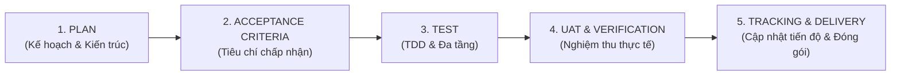

# Tiêu Chuẩn Quy Trình Phát Triển & Hợp Tác Agentic (Development Workflow Standard)
## PIM Tool Backend (`pilot-project-back`)

Tài liệu này định nghĩa khung quy trình làm việc chuẩn mực (Framework Standard) giữa **Kỹ sư phát triển (Developer)** và **Trợ lý AI Agent (Antigravity Agent)** trong toàn bộ vòng đời phát triển dự án PIM Tool, bao gồm: **Plan -> Acceptance Criteria (AC) -> Test -> UAT -> Tracking Progress**.

---

## 1. Triết Lý & Nguyên Tắc Cốt Lõi (Core Principles)

1. **Evidence-Based Engineering (Kỹ thuật dựa trên bằng chứng):**
   - Mọi kết luận về hiệu năng, query count, Lazy/Eager trap, transaction lock hay exception handling đều phải được chứng minh bằng log thực tế (P6Spy), stack trace, hoặc kết quả chạy test tự động.
   - Tuyệt đối không phỏng đoán hay đưa ra nhận định cảm tính.

2. **Test-First & Regression Prevention (Bảo đảm kiểm thử liên tục):**
   - Mọi thay đổi logic hoặc sửa lỗi (bug fix) phải có test case đi kèm để tái hiện và xác minh.
   - Toàn bộ test suite (hiện tại 68 tests) phải luôn duy trì trạng thái **100% Green (`BUILD SUCCESS`)** trước khi kết thúc tác vụ.

3. **No Unwanted Side Effects (Không gây phản ứng phụ trên Database/ORM):**
   - Mọi câu query sinh ra từ Hibernate/JPA/QueryDSL phải được kiểm soát chặt chẽ (Zero N+1, số lượng query tối thiểu, đúng loại join inner/left outer, loại bỏ cross join không mong muốn).

4. **Preserve Documentation Integrity (Bảo toàn tính nhất quán tài liệu):**
   - Tài liệu kỹ thuật, báo cáo bài tập và tài liệu lý thuyết được lưu trữ có cấu trúc trong thư mục `docs/`.
   - Lịch sử Git luôn được bảo toàn (`git mv`), thư mục gốc luôn gọn gàng và tinh gọn.

---

## 2. Quy Trình 5 Giai Đoạn Chuẩn (5-Stage Delivery Pipeline)

Mỗi tính năng, cải tiến kiến trúc hoặc bug fix đều tuân thủ nghiêm ngặt 5 giai đoạn sau:



---

### Giai Đoạn 1: Plan (Kế Hoạch & Phân Rã Kỹ Thuật)

Trước khi viết bất kỳ dòng code nào, Agent và Developer cùng làm rõ:
- **Mục tiêu kỹ thuật (Goal):** Yêu cầu cần giải quyết là gì? (Ví dụ: Chuyển đổi quan hệ One-to-One thành Unidirectional, tối ưu pagination query, xử lý concurrent update).
- **Phân tích tác động (Impact Analysis):**
  - Ảnh hưởng tới Database Schema (Foreign keys, Unique constraints).
  - Ảnh hưởng tới Hibernate Entity Mapping (Cascade, FetchType, Bytecode Enhancement, Proxy).
  - Ảnh hưởng tới Repository / Service / DTO / Controller.
- **Chiến lược thực thi (Step-by-Step Execution Plan):**
  - Thứ tự chỉnh sửa từng file cụ thể.
  - Dự phòng các lỗi tiềm ẩn (breaking changes, mapping mismatch).

---

### Giai Đoạn 2: Acceptance Criteria (AC - Tiêu Chí Chấp Nhận)

Mỗi task phải có bộ tiêu chí chấp nhận cụ thể, có thể kiểm chứng độc lập theo định dạng **Given - When - Then** hoặc checklist tiêu chí:

#### Mẫu Định Dạng AC (Acceptance Criteria Template):
1. **Chức năng (Functional AC):**
   - `AC-F1`: Khi gọi API tìm kiếm dự án với tiêu chí `name`, `status`, `customer`, `groupLeaderVisa` -> trả về danh sách phân trang chính xác.
   - `AC-F2`: Khi xóa danh sách dự án (batch delete), nếu có dự án ở trạng thái khác `NEW` hoặc không tồn tại -> ném `ProjectBatchDeleteException` chứa danh sách ID chi tiết.
2. **Phi chức năng & Hiệu năng (Non-Functional & Performance AC):**
   - `AC-NF1 (Query Count)`: API search dự án với phân trang **chỉ được phép thực thi đúng 2 câu SQL** (1 câu `SELECT PROJECT ... LIMIT ? OFFSET ?` và 1 câu `SELECT COUNT(*) FROM PROJECT ...`).
   - `AC-NF2 (Lazy Loading)`: Không phát sinh truy vấn phụ (N+1) vào bảng `GROUP` hoặc `EMPLOYEE` khi map sang `ProjectDto`.
   - `AC-NF3 (Concurrency)`: Cơ chế Optimistic Locking với trường `@Version` phải ngăn chặn thành công hiện tượng Lost Update / TOCTOU.

---

### Giai Đoạn 3: Test (Kiểm Thử Đa Tầng - Testing Strategy)

Dự án áp dụng tháp kiểm thử (Testing Pyramid) toàn diện:

```
                  ┌──────────────────────────────┐
                  │    Controller Web MVC Test   │  (MockMvc, HTTP status, JSON payload)
                  ├──────────────────────────────┤
                  │     Service Unit Test        │  (Mockito, Business logic isolation)
                  ├──────────────────────────────┤
                  │   Data Repository Test (H2)  │  (Spring Boot Test, Database interaction)
                  ├──────────────────────────────┤
                  │   QueryDSL & SQL Verification│  (Predicate generation, P6Spy SQL asserts)
                  ├──────────────────────────────┤
                  │ Database Execution Plan Test │  (H2 EXPLAIN ANALYZE index inspection)
                  ├──────────────────────────────┤
                  │ Bean Validation Rules Test   │  (JSR-380 Validator constraints)
                  └──────────────────────────────┘
```

#### Quy tắc kiểm thử bắt buộc:
1. **Viết test trước hoặc song song với code:** Bảo đảm test case fail trước khi fix và pass sau khi fix.
2. **Assert SQL Query Count:** Sử dụng `SqlCaptureInspector` hoặc P6Spy logs để kiểm tra số lượng câu SQL sinh ra trong mỗi kịch bản.
3. **Chạy toàn bộ Test Suite:** Lệnh `mvn clean test` phải kết thúc với `BUILD SUCCESS` (toàn bộ 68/68 test case passed).

---

### Giai Đoạn 4: UAT & Verification (Nghiệm Thu & Xác Minh)

Xác minh tính đúng đắn trên môi trường runtime thực tế:
- **Kiểm tra Logs P6Spy:** Xem xét kỹ lưỡng từng câu SQL đã format đẹp mắt, bảo đảm các mệnh đề `JOIN`, `WHERE`, `ORDER BY`, `LIMIT` chính xác.
- **Kiểm tra HTTP Status & Response Body:** Xác nhận đúng format lỗi RESTful, ví dụ lỗi 400 Bad Request trả về đầy đủ `message`, `notFoundProjectIds`, `invalidProjectIds`.
- **Nghiệm thu đối chiếu AC:** Lập bảng đối chiếu từng AC với bằng chứng (logs/test results).

---

### Giai Đoạn 5: Tracking Progress & Delivery (Quản Lý Tiến Độ & Đóng Gói)

#### Vòng đời trạng thái công việc (Task Lifecycle States):
```
[BACKLOG] ──> [PLANNED] ──> [IN_PROGRESS] ──> [TESTING] ──> [UAT_VERIFIED] ──> [DONE]
```

- `[BACKLOG]`: Nhiệm vụ được ghi nhận nhưng chưa phân tích chi tiết.
- `[PLANNED]`: Đã có Plan và Acceptance Criteria rõ ràng.
- `[IN_PROGRESS]`: Đang hiện thực hóa mã nguồn hoặc sửa lỗi.
- `[TESTING]`: Đang chạy test tự động, bổ sung test case và đo đạc SQL query count.
- `[UAT_VERIFIED]`: Đã xác minh nghiệm thu thực tế, đạt tất cả AC.
- `[DONE]`: Đã commit mã nguồn, cập nhật tài liệu liên quan.

#### Quy ước Git Commit (Conventional Commits):
- `feat:` Bổ sung tính năng mới (ví dụ: `feat: add batch delete API with detailed error payload`).
- `fix:` Sửa lỗi (ví dụ: `fix: eliminate N+1 queries on project pagination search`).
- `refactor:` Tái cấu trúc mã nguồn không làm thay đổi hành vi (ví dụ: `refactor: convert Group-Employee to unidirectional one-to-one`).
- `test:` Bổ sung hoặc cập nhật test case (ví dụ: `test: add P6SpySqlFormatter unit tests`).
- `docs:` Cập nhật tài liệu (ví dụ: `docs: organize markdown files into docs folder structure`).

---

## 3. Khung Năng Lực & Vai Trò Của AI Agent (Agent Skills & Capabilities)

Để hỗ trợ Developer tối đa, Agent vận hành với các năng lực chuyên biệt (Skills):

| Kỹ Năng / Role | Trách Nhiệm Chi Tiết | Công Cụ Sử Dụng |
|---|---|---|
| **Architect & Planner** | Phân tích bài toán, thiết kế schema, đề xuất giải pháp tối ưu cho Spring Boot / Hibernate / JPA. | `view_file`, `write_to_file` |
| **Deep-Dive Debugger** | Bắt lỗi tận gốc: Phân tích bytecode enhancement, proxy initialization, TOCTOU race conditions, lazy loading trap. | `run_command` (mvn test), `P6Spy`, Stacktrace analyzer |
| **Test Automation Engineer** | Viết unit test, integration test, mock data, cấu hình SpringBootTest và assertion chặt chẽ. | JUnit 4, Mockito, Spring MockMvc, AssertJ |
| **Documentation & Quality Gatekeeper** | Lưu trữ tài liệu gọn gàng theo chuẩn thư mục `docs/`, cập nhật `README.md`, theo dõi tiến độ công việc. | Markdown, Mermaid, `git mv` |

---

## 4. Bảng Kiểm Tra Tiến Độ Mẫu (Progress Tracking Template)

Khi thực hiện bất kỳ Feature / Bugfix nào, sử dụng bảng kiểm sau:

```markdown
### 📋 Feature / Bugfix Tracking: [Tên Nhiệm Vụ]

- [x] **1. Plan:** Phân tích yêu cầu và thiết kế giải pháp kỹ thuật.
- [x] **2. Acceptance Criteria (AC):** Xác lập tiêu chí kiểm thử định lượng.
  - [x] AC-1: [Mô tả tiêu chí 1]
  - [x] AC-2: [Mô tả tiêu chí 2]
- [x] **3. Implementation:** Hiện thực mã nguồn sạch, tuân thủ Clean Code.
- [x] **4. Test Automation:**
  - [x] Bổ sung Unit / Integration Tests tương ứng.
  - [x] Chạy `mvn test` - 100% tests passed.
- [x] **5. UAT & Verification:** Kiểm tra SQL log thực tế (Zero N+1, đúng query count).
- [x] **6. Documentation & Clean-up:** Cập nhật tài liệu kỹ thuật, giữ git working tree sạch sẽ.
```
